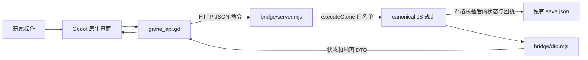

# 三国城志 Godot 客户端架构

本文记录 0.1.1 首轮迁移的实际结构。Godot＋GDScript 负责原生地图、城池、战斗表现和操作界面；Node.js 本地规则服务运行原游戏的 JavaScript 玩法与存档校验。这里的“权威”指同一份本地进度的唯一结算入口，尚未接入公网多人权威服务器。

## 原项目与迁移来源

原项目是 `https://github.com/YuJieMichael/three-kingdoms`，保留在提交 `c7674df45b9595405e57907524e737e633b0ff63`。原 GitHub 仓库、工作目录与现有 GitHub Pages 不由本次迁移修改。Godot 客户端在独立仓库开发和发布。

`vendor/legacy/provenance.json` 记录规则快照的原仓库、提交和文件清单。`vendor/legacy` 包含 33 个规则与数据模块、`online/runtime.mjs` 及生成的 `supabase/functions/_shared/game-runtime.mjs`。规则运行时哈希为：

```text
432f9fea6359c18a8d1e2655b09f97770718c3e676501c602c7897afd906a8b4
```

名称中的 `supabase` 来自原项目的文件布局；本地桥接不连接 Supabase 项目，也不部署该目录中的服务。复用的是可在 Node 中运行、隔离时间、随机数和存储的原游戏运行时。

## 模块与职责



| 模块 | 职责 |
|---|---|
| `src/main.gd` | 导航、资源与任务面板、建筑、训练、研究、背包、出征和存档交互 |
| `src/world_map.gd` | 独立相机、连续拖动、缩放、地形、城旗、路线与行军时间表现 |
| `src/city_view.gd` | 城内和城外的原生场景表现 |
| `src/battle_view.gd` | 真实兵种位置、射程、指令与回合事件动画 |
| `src/game_api.gd` | 启动或连接规则服务、顺序请求、轮询、版本处理和未确认命令恢复 |
| `bridge/server.mjs` | 本地 HTTP、认证、进程锁、原子持久化、CAS 与命令回执 |
| `bridge/dto.mjs` | 把规则状态投影成适合 Godot 渲染的 DTO |
| `vendor/legacy` | 原游戏的建筑、经济、科技、军队、行军、战斗、任务和存档规则 |
| `data/map_regions.json` | 当前地图上的分区显示配置 |
| `scripts/build.py` | 导出 Windows/Web、打包规则服务和运行时、生成哈希清单 |

GDScript 不维护第二套资源增长、建筑费用、训练条件或战斗伤害公式。玩家的真实操作必须通过已有 `executeGame` 白名单，例如 `queueBuilding`、`developPlot`、`train`、`research`、`dispatch`、`startBattle`、`battleRound` 和 `setBattleOrders`。客户端不能提交任意 Game 方法或把客户端状态注入普通命令。

## 桌面启动与网页启动

Windows 试玩包包含 `ThreeKingdoms.exe`、资源包、`runtime/node.exe` 与 `rule-service/{bridge,vendor/legacy}`。游戏资源在本地包内；规则服务随客户端启动。Godot 生成连接密钥，以 `--port 0` 请求可用端口，并把进度存放在 Godot 用户数据目录的 `progress` 子目录。Node 写出 `{url,pid,protocol}` ready 文件，Godot 核对子进程 PID 后开始连接；ready 文件不包含连接密钥。

Godot 编辑器运行可通过 `TK_NODE` 指定 Node 路径。手动连接使用客户端的 `--api=<URL>` 参数和 `TK_BRIDGE_TOKEN`，或界面的连接设置。

浏览器不能启动 Node 子进程。Web 导出通过桥接的 `--web-dir build/web` 或网页试玩包的启动脚本提供静态文件，并连接同源 `location.origin + '/api'`。根路径接口和 `/api` 接口等价。每个网页试玩服务目录目前只有一份进度；多个浏览器连接它会操作同一份本地进度，通过 CAS 协调。它不是多个独立玩家账号的服务器。

桌面和网页试玩使用同一套规则与原存档格式。当前自动跨端共享账号与进度尚未建立，需要之后的账号、服务端存储和认证方案。

## 状态、版本与恢复

桥接存档头部是 `{schema,authorityId,revision,state,receipts}`。

- `authorityId`：一份进度的稳定 UUID，重启和导入旧网页存档均不更换；用于阻止把未确认命令重放到另一份进度。它不是登录身份或密钥。
- `revision`：成功变更后增加的整数版本。命令必须带 `expectedRevision`，过期版本返回 `REVISION_CONFLICT`，不会覆盖较新的进度。
- `commandId`：一次有意操作的唯一编号。网络重试必须保留原编号、原参数与原预期版本；重试不得另造编号再次扣款。
- `receipts`：最近 32 项成功操作的原结果，与状态一起原子保存。相同编号与相同请求重放原结果；同一编号换参数返回 `ID_REUSED`。更旧的请求因预期版本过期而不能再次执行。

客户端发送变更前，把未确认请求与所属 authority 写入 `user://pending-command.json`。断线或客户端重启后，先读取 `/health` 核对 authority；匹配时重发原请求，收到成功或明确规则/版本拒绝结果后清除 pending。网络异常、未获授权或服务端 5xx 时保留原请求。不能把“不知道服务器是否完成”直接等同于“操作没有发生”。

桥接通过私有目录进程锁防止两个 Node 进程同时结算同一份进度。每次写入先写临时文件并同步，再替换 `save.json`，状态和回执在同一文件中提交。客户端退出会终止它启动的规则子进程；桥接另提供必须持有效密钥调用的 `/shutdown`，用于主动关闭。进程异常终止后的遗留锁在下一次启动时核对旧 PID 后处理。

`GET /state`、`GET /world` 和 `GET /export` 按当前时间生成一次性规则投影，不写入资源余额、版本或回执。下次成功命令才提交原规则计时结算。建筑完工、人口增长、收入和小时薪俸由同一个旧时间戳重算，读取、随后操作与重启不会重复发奖励或重复扣款；集成测试覆盖这一链条。随机加速与战斗掉落只在明确命令中消费，重试返回持久化回执，不重新抽取。

## 存档与渲染合同

`GET /export` 返回原游戏的裸 state JSON。`POST /import` 把浏览器导出的对象放入 `{commandId,expectedRevision,state}`，先执行支持的原格式迁移，再严格 `validSave`。无效数据不替换存档；合法导入前保存 `before-import.json`。当前界面迁移没有覆盖全部旧系统，但旧存档对应字段保留在 canonical state 中。

状态接口返回 `{authorityId,revision,state,view,serverTime}`。`view` 的费用、工期、解锁条件和兵种统计来自 Game API；资源速率单位为每分钟，商城货币为元宝 `gems`。`view.queues` 是以 build/train/research/defense 为键的字典，每个值都是数组；canonical state 的研究队列仍保持原来的单对象或 null。

加速必须调用 `useSpeedup([itemId,target.key])`。`queueMetadata` 和库存的 `targets` 来自 `Game.speedupTargets()`，携带队列种类、真实 key 与等待时间。不能把加速道具当作不需要目标的普通 `useItem` 使用。

`view.battle` 和 `view.reports` 保留原战斗与战报对象。动画消费已确认的 `currentRoundSummary.events`，不会自己计算一次伤害。`strike` 是攻击事件，`recoil` 是受击事件，包含阵营、兵种、目标、位置、伤害和阵亡数量。

地图保持原有 64×64 坐标、节点 ID 与已有军队的开始/抵达时间戳。未来任务据点在地图 DTO 中变成匿名地形，当前可见节点列表不包含其真实身份。分区配置用于地图缩放层级显示；当前没有把权威世界扩大为完整各州。真正扩图需同时迁移规则坐标、存档、目标与服务端约束。

## 安全边界和验证范围

规则服务强制监听 loopback。桌面连接使用临时密钥；手动开发支持不带密钥，但仅用于本机开发。默认拒绝非本机网页 Origin；可显式配置精确允许的 Origin。token 不通过 URL 传递。静态目录与进度、ready 文件、token 文件分离，拒绝目录穿越和逃出静态根目录的符号链接；接口不暴露目录列表。请求使用 JSON，体积上限为 16 MiB。

这些措施适用于本地试玩。连接密钥、authorityId 和本地 CAS 不构成公网玩家认证、全局名将唯一占有、跨玩家交易托管或反作弊系统。当前 Steamworks、Steam 身份绑定、成就、云存档与公网多人后端均未接入；没有启用正式 Supabase 项目。

规则桥接已通过真实 HTTP 集成验证：存档重启、原网页 JSON 导入、CAS 与重复请求、原建筑/训练/行军/召回、战斗指令与实际结算、随机加速不重抽、只读计时不重复结算、Origin/密钥、静态目录隔离和 ready 文件生命周期。Godot 解析、桌面实际操作、Web 实际运行、Windows 导出与 Windows 实机运行须分别记录；导出一个 Windows 可执行文件不等于已经在 Windows 实机玩过。

后续优先把客户端交互和本地试玩稳定下来，再接入正式账号与服务端权威结算，然后接 Steamworks。保持渲染 DTO 与 canonical 规则边界，便于以后把当前本地规则入口替换成有玩家身份和世界归属的服务端入口。
