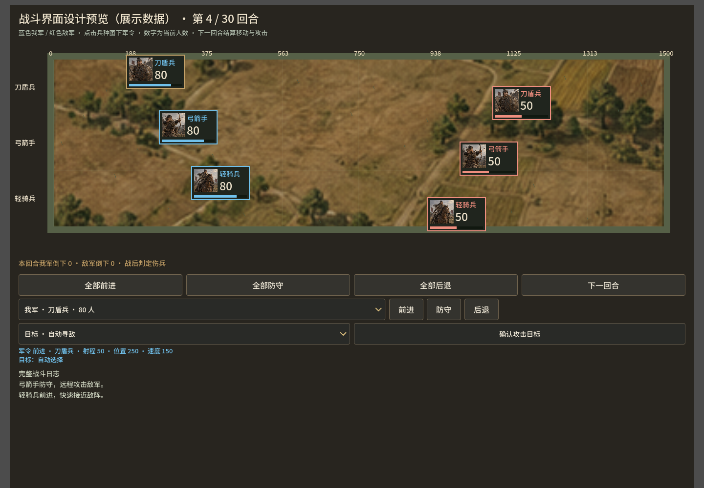

# 从基础体验开始整改（dev.14）

本次针对用户实际试玩后的反馈：与老版《热血三国》差距太大、没有操作指导、战斗看不清、音乐只有淡薄提示声。优先改动入口、战场阅读与配乐，不将增加系统数量作为完成标准。

## 新手指导

- 默认进入城内，而不是将玩家直接放到大地图。
- 尚未完成首战引导的私人进度，顶部常驻“当前该做什么”。使用真实 `growth.current`、任务达成状态和资源缺口，不靠点击“下一步”假装达成建设条件。
- 任务已达成时，指引按钮直接领取当前任务奖励；其他时候定位实际建筑、研究、募兵或出征入口。
- 每份规则服务进度首次看到这一版指引时显示操作介绍，可直接开始当前步骤、查看礼包，或进入独立借调战斗教学。菜单“新手引导”可以再次打开。
- 欢迎记录只写入本机独立配置，不更改军队、资源、任务或旧档结构。

## 战斗指挥

- 正式战斗使用独立的大窗口；战斗开始后自动显示，军队页保留“进入战场指挥”入口。关闭窗口只是回城，不发送撤退命令。
- 战场放在窗口上方，原先挤在战场前的三层控制移至战场下方。兵种过多时仅战场内部滚动，避免将兵队压成几像素。
- 用原网页项目的原创写实兵种图集代替线条小人；蓝色我军、红色敌军，分别显示人数和血量。败亡兵队保留零人数标记。
- 显示原规则位置、距离标尺、射程区域与速度；兵队可点选，保持前进、防守、后退、指定攻击目标的实际命令。下一回合只在这一回合显示动画结束后恢复可点击。
- 动画分移动、攻击和伤亡，时长从0.95秒增加至1.8秒；不会修改服务端伤害、单位速度或胜负。
- 借调教学使用同一战场显示，并扩大窗口宽度。

老版参考：[4399战斗界面说明](https://web.4399.com/rxsg/yxzl_gcld_30_781.html)、[2009年基本操作](https://news.4399.com/rxsg/youxigonglue/200906121408.html)。原说明明确支持每类兵种前进、防守、后退及指定攻击目标。本次靠拢这些指挥操作，没有复制官方画面或音乐。

## 音乐

去掉八音正弦循环作为背景音乐。接入 Kevin MacLeod 的完整曲目：经营播放 [Temple of the Manes](https://incompetech.com/music/royalty-free/index.html?isrc=USUAN1100053)，战斗播放 [Five Armies](https://incompetech.com/music/royalty-free/index.html?isrc=USUAN1100875)。两曲使用作者 CC BY 4.0 署名许可，完整来源见 `assets/audio/CREDITS.txt` 和包内许可证；游戏菜单鸣谢显示署名。桌面自动起播，网页仍遵守首次用户点击后起播；场景切换淡入淡出，保持玩家已有静音选择。

## 验证与边界

完成 Godot 编辑器导入与脚本解析。使用 Godot 实际渲染过三种兵队的**设计展示数据**，观察并修正了图卡大小、背景、兵队滚动和军令区位置。展示图不是实战录像，也不证明回合、引导或音频流程已完整功能测试。本轮没有新增或运行功能测试。

制作新的 Windows/Web 试玩包供实际反馈。原仓库和旧存档位置保持；既有规则、商城及可选补给功能保留。这仍是向老版操作靠拢的第一轮基础整改，建筑与经济、地图结构及完整原版美术尚未全部复刻。

## 构建结果

Windows Release 与 Web Release 已成功导出，打包包含完整音乐文件及署名说明，构建日志未出现脚本错误。未运行本轮功能测试；dev.13 的运行与规则检查结果不作为本轮修改的验证。

