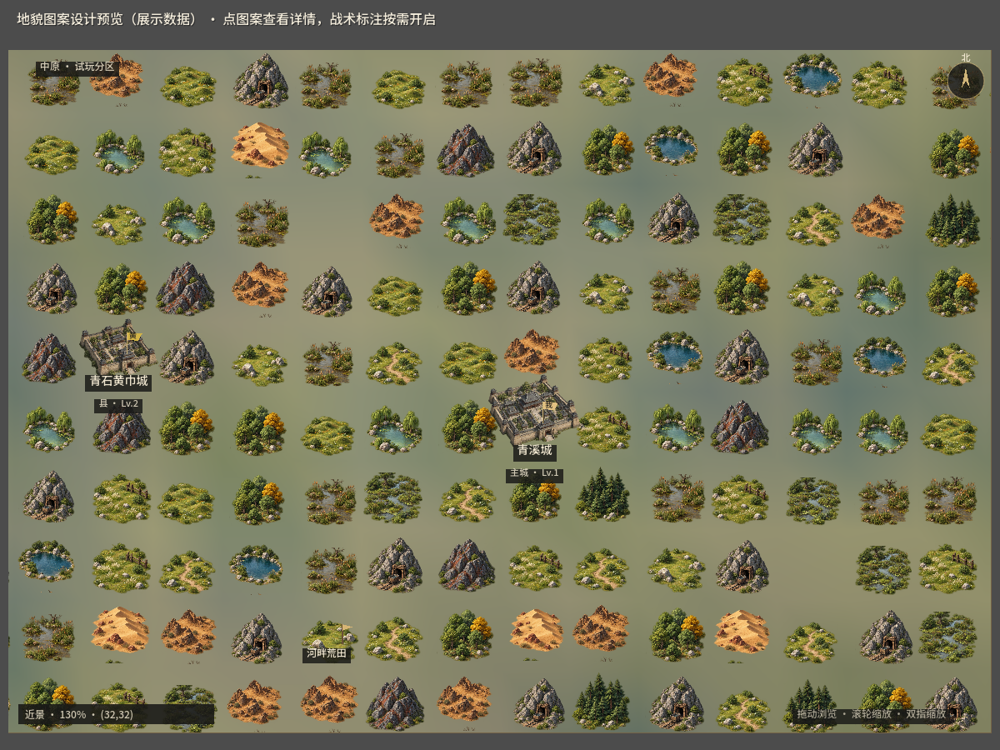
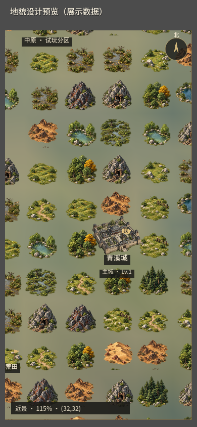
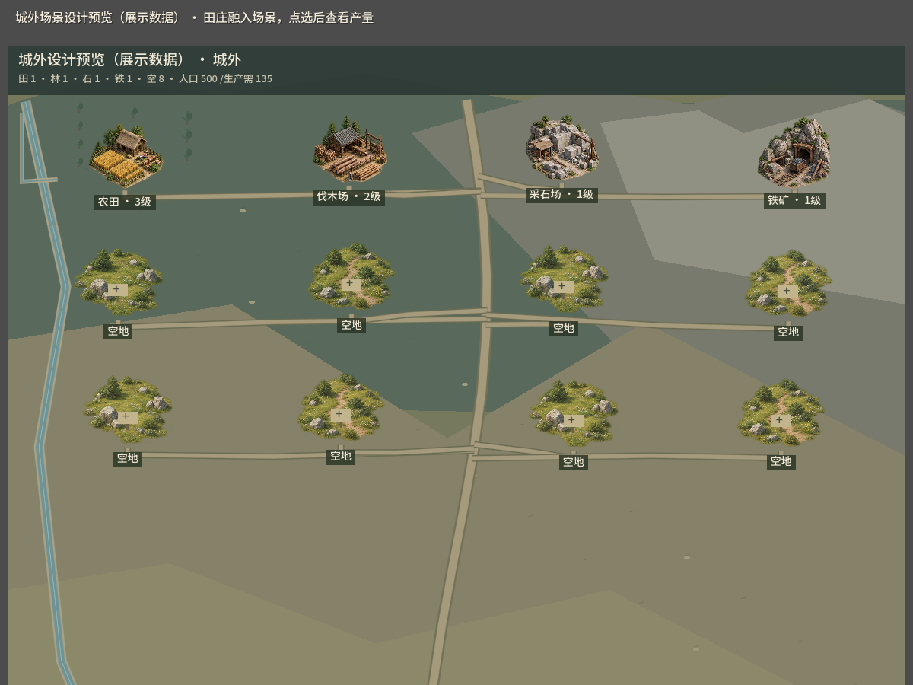

# dev.18：地貌图案与轻量城景

## 已修改

- 世界地图新增16幅透明地貌／营寨图案：平地、草原、森林、山地、荒漠、湖泊、沼泽各两种，营寨两种。轮廓、比例和位置有小幅确定性变化，图案保持在对应真实地块内。
- 默认隐藏格线和满屏野地等级，不再给每个野地叠加黑色文字条与圆形资源字样。点击图案显示光圈及类型、等级，悬停可看目标提示，收益和出征继续在既有详情中查看。
- 顶部可按需开启“战术标注”，同时显示格线与野地类型／等级；“资源”筛选显示资源和等级。默认缩放提高到105%，手机和桌面用同一比例逻辑。
- 城池、任务和本人已占领目标仍有独立旗帜。隐藏任务不绘制图案或提示。普通荒田、森林等任务沿用实际地貌，仅真实营寨使用营寨图片。
- 城外田庄取消深色整块卡片和常驻边框，图案直接融入道路、水渠与山林。空地使用自然草地与建设路牌，选中时用光圈，产量在选中／悬停或施工时显示；点选后仍可看完整建设／升级收益。
- 城内取消地块常驻边框和编号，空地换成草地与建设路牌；编号在选中、悬停或键盘聚焦时显示。建筑标签收窄到文字宽度，键盘聚焦仍有清晰边界。

本批只调整表现。36个城内地块、城外容量、世界坐标、实际兵力、野地刷新及玩家存档继续使用已接入规则。背包保留之前要求的分类格子。

## 素材与实现

使用内置`image_gen`工具生成一张图集，保存到`assets/environment/world-map/world_terrain_icons_v1.png`。这是项目新生成素材，没有使用原版游戏图像作输入。原PNG像素与透明通道完整保留，没有重新绘制或抠图；通过读取透明像素范围生成`data/world-terrain-art-atlas.json`，使用Godot的AtlasTexture直接取源区域。

图集大小1254×1254，16个区域来源于4×4排布；实际源区域逐格按alpha>32测量。加载时缓存纹理和源区域，位置变体由坐标确定；没有每帧加载图片。城外空地复用图集的两种草地，建筑仍用既有图片。

### 使用的生成提示词

```text
Use case: stylized-concept. Asset type: ONE production terrain sprite ATLAS for an ancient Chinese Three Kingdoms strategy game, intended for rendering small individual landforms on a seamless map. Generate one square PNG with a genuinely transparent alpha background, a precise invisible 4 by 4 grid of 16 isolated landform illustrations, no cell lines and no text. Each subject sits completely inside its equal-sized cell with at least 12 percent transparent padding on ALL sides, centered on the same bottom baseline, no overlapping cells. Every motif has an irregular organic outline, NEVER square, diamond, hexagon or tile-shaped ground bases, NEVER icon badge frames. Art style: premium readable painted 2.5D strategy game sprites, oblique top down 35 degree view, tangible earthy rock and leafy vegetation, bright enough to read against muted olive terrain, restrained ink detailing, warm afternoon light upper left, soft short contact shadows ONLY beneath objects, crisp silhouettes legible at 55 pixels. Coherent scale and palette throughout. Precise ordered motifs, read LEFT to RIGHT then TOP to BOTTOM: ROW 1: [plain meadow with low grass and scattered pale boulders; a different open meadow with a tiny winding dirt footpath and small shrubs; lush rolling grassland with low grassy mounds and wildflowers; different lush pasture with grass tufts and a tiny ancient wooden fence fragment]. ROW 2: [cluster of tall deep green pine trees; varied deciduous forest grove with one golden tree; rocky iron-rich dark grey mountain with visible rust iron veins; different steep grey rocky mountain with a small ancient mine entrance and a wooden ore cart]. ROW 3: [golden arid sand dunes with sparse reddish rocks; different ochre dry rugged wasteland with wind-scoured stones; blue oval irregular lake with a rocky green shoreline and ONE small reed cluster; different curved turquoise pond with stones and willows]. ROW 4: [olive wetland pools with reeds and tangled green vegetation; different marsh with muddy water and cattails; small ancient bandit encampment with two ochre tents and a wooden watchtower; different fortified wooden camp with palisade and two faded yellow banners]. Each motif is a small complete scene with distinct SHAPE, no people, no interface, no label, no number, no watermark, no border, no background canvas color, no decorative objects between cells. Output the full single atlas at high resolution with authentic transparency.
```

## 检查边界

- Godot脚本导入编译、Windows/Web导出完成；新图集及元数据纳入包和构建清单。
- 1200×900地图、选中地图、城内／城外，以及390×844地图／城外静态设计预览已生成并查看。开发城池与资源田是明确标记的展示数据，窄屏城外截图只展示滚动场景的上段。
- 首次设计预览误用城内`set_view`方法，已改为现有`set_city`并重新生成；此错误仅存在于忽略的设计脚本。
- 本轮没有新增或运行功能测试；图案点选、拖拽、移动端触摸、战术标注和长期性能还未实战验证。没有执行玩家购买、建设、侦察或战斗。






