# Godot 验证记录

## 0.6.0-dev.11 城池空间、成长外观与建设决策

2026-10-07：story017 Complete。六项街巷/环境/已完成等级外观/同窗建设/手机HUD/只读收益对照全部接入独立Godot版，原网页及vendor保持。最终11组headless **5973项**、Node **38项**、macOS原生城景1324＋面板37＝**1361项**通过；最终包审计205、Windows/Web导出PCK各93、HTTP20通过。编译资源各用自身解包API和一次性新档确认真实第36格民房，得到revision1、0级地基与原工期。Windows EXE未在Windows执行。

最终Web1280×1000与390×844已观察，资源一行仍可详查，目标描述/奖励能展开且中文按钮保持44px，空队列与建设Window完整在屏内，费用/工期/确认固定，目录分类/筛选/真实滚动返回保持；军情菜单、官府定位、末排34–36与南门可达。error/warning均0，预览未提交消费命令、revision0，原进度和副本持久化摘要相同。手机viewport与合成触摸不代替实体手机；准备城景不是自然成长。

完整结果与失败修复记录见[本轮报告](../production/polish/city-design-polish-report-2026-10-07.md)、[QA聚合](../production/qa/evidence/story-017/qa-summary.json)。Node原始stdout未保留，agent-test-results明确为负责代理已完成工具执行摘要；重复复核与旧版不加入最终数量。编译退出曾有活动音频对象提示，经探针正常停止音频再退出后两包无错警；包源未变。此前并发启动超时另保留。最终包在`build/city-polish-0611-final/`，本机试玩17359；没有公开发布、云联调或Steamworks上线。

## 0.6.0-dev.10 清晰内城地块与写实RTS建筑

2026-10-07：故事016最终源码、Web、导出和编译PCK复核通过。内城36格按真实site排列，桌面6×6、手机3×12；官府、保留地和重复建筑身份固定。空地打开当前权威建筑目录，选择仅预览，确认时核对最新费用、工期、条件、占用、来源城池、资源、队列、连接和pending状态，再提交精确site。手机城务工具栏固定，官府定位只滚动和高亮。17个视觉区域对应16种真实建筑与装饰南门，来自7张透明源图，另有独立地表材质；0级地基、升级队列、等级和等比显示保留。

九组针对性headless共 **5659项通过**，全部exit0、无错误或警告；Node桥接另有 **23项通过、0失败**。九组明细为网格1313、历史城池2714、建筑贴图456、主界面建设111、客户端236、玩法UI125、界面表现351、战争界面98、输入255。最终主弹窗窗口修复后，`historic_structure_client`再次通过 **111项**；这是受影响入口复跑，不重复加入5659。日志见 [九组汇总](../production/qa/evidence/story-016/scoped-gd-results.json)、[Node桥接](../production/qa/evidence/story-016/node-bridge.log)和[最终建设窗口复跑](../production/qa/evidence/story-016/historic-structure-client-final.log)。

macOS原生网格 **1316项通过**（含3张截图保存），已只读复核桌面全类型、手机混合施工和新城截图：建筑可辨、区域不串图或压扁，无可见暗底块；编号、等级、0级地基和升级倒计时清楚。素材尺寸/SHA匹配，同源区域不重叠。完整手机混合图为390×2116，桌面图为900×1284；首张新城手机图390×1518，仅展示至地块28–30，末行和南门另由最终Web滚动截图补充。prepared多建筑基础来自权威规则fixture，0级与升级队列使用隔离状态投影做表现检查，不代表自然成长；390视口及合成输入不代替物理手机验证。日志与图像保存在 [story016证据目录](../production/qa/evidence/story-016/)。

最终Web在1280×1000和390×844实际观察并点击“目录→建筑预览→返回目录→关闭”，两个尺寸的warning/error均为0；固定工具栏、官府定位、手机末行地块34–36与南门已截图。预览0次mutation、revision0，原存档与预览副本SHA保持。见 [最终浏览器记录](../production/qa/evidence/story-016/web-browser-final.json)与[进度完整性](../production/qa/evidence/story-016/save-integrity.json)。

Windows/Web最终构建位于 `build/city-grid-0610-final/`，版本为0.6.0-dev.10；本机预览地址为 [17358](http://127.0.0.1:17358/)。两包归档审计 **196项通过**；Windows与Web两份PCK在macOS各 **76项通过**，分别连接自己解包出的fresh规则API并实际确认`house#35`，每个隔离QA副本仅1次mutation，未操作玩家预览。归档与两份编译包合计348项。**本轮Windows EXE未实际运行**，macOS加载Windows导出的PCK不能替代Windows运行验证。原网页、现有Pages、旧进度和vendor权威规则保持；以下保留历史版本证据。

## 0.6.0-dev.9 大地图山川与城池层级

2026-10-07：真实tier投影、六区透明图集、三层缩放、紧凑筛选/手机缩放、关系旗字/资源类型、行军方向与服务器时钟、透明屋顶选择完成。Scoped headless1192、native地图317与连续地形58、Node新5/原bridge23独立、工具栏59通过；最终包归档186＋两PCK各59＋HTTP18=322通过。实际最终Web1280/390观察，warning/error0，revision0且source/copy存档不变。WindowsEXE与真手机未测，候选performance不作最终FPS承诺。详细范围及初轮修正见[地图贴图报告](../production/polish/world-map-art-report-2026-10-07.md)。

## 0.6.0-dev.8 城内建筑贴图与体量

18缓存区域覆盖16真实建筑及南门，备用募兵所不创建地块。两张RGBA图集的alpha/摘要、区域、等比、命中、fallback、0级和升级队列均已验证；desktop1160/phone900高，真实site保留。手机建设详情费用与条件换行。

相关12个GDScript入口最终聚合5380项、macOS主整合88项、独立触控48项通过；局部手机费用修复后复跑受影响客户端236和建设窗口82（含新增19项）。Windows/Web包300项通过（归档183、两PCK各51、HTTP15）；实际1280×1000与390×844浏览器看到新贴图、真实官府/空地36和南门滚动，未提交消费，revision0、save不变。最终2026-10-07T07:10:48.244Z重载后warning/error0，历史锁拒绝/切包瞬断和输入接口超时保留记录。viewport恢复、tab76/预览17356保留，最终包build/commanding-art-0608-final。prepared截图为展示fixture；Windows EXE和物理手机未测。见[建筑贴图报告](../production/polish/commanding-city-art-report-2026-10-07.md)。以下为历史记录。

## 0.6.0-dev.7 城池与田庄的历史空间结构

2026-10-07：故事013 Complete，最终源码和导出已验。城内以土城垣、南门主街、北侧官署庭院与四坊组织建筑，只有真实建筑记录绘成建筑；重复建筑、保留地和空地对应固定site。城外以道路、水渠、农田、林地、采石与矿场连接真实开放index；城务与样板折叠，具体地块详情沿用权威费用、工期与原命令。

触控改为松手后确认点击，拖动交给父滚动区。独立真实Viewport→ScrollContainer链路的24项headless与24项macOS原生检查通过；大幅及多帧拖动、取消不选择地块。最终源码相关11个GDScript入口4912项通过，全部exit0无SCRIPT ERROR/ERROR；Node桥接与realm31项通过、0失败/跳过，原生主整合69项通过并更新6张prepared截图。空地四用途费用/工期/门槛和全队列禁用已完成，独立最终复查无阻断。Windows/Web最终导出、241项包检查通过（归档174＋两PCK各26＋Web HTTP15），两份PCK在macOS加载并连接解包规则服务，不等于Windows EXE运行。

实际最终Web1280×1000/390×844已观察内城、精确空地36、城外12地块、3号空地四用途报价与下部操作按钮/样板，窄屏下滚至南门未误开弹窗；未提交消费，revision0，viewport已恢复。服务重启时旧客户端有一次Failed to fetch；最终06:34:02.580Z重载后warning/error0，历史瞬断保留于web-observations.json。预览17355使用17351进度副本，旧进度保留。prepared developed截图仅用于多类型场景与操作展示，不代表自然成长。390浏览器与合成触摸不等于真手机；Windows EXE未实机运行。构图参考汉代坊市与夯土墙，程序绘制不声称精确复原或正式写实素材。详见[历史空间结构报告](../production/polish/historic-city-report-2026-10-07.md)。以下为历史记录。

## 0.6.0-dev.6 战争界面

2026-10-07：3166项自动检查通过（Node183、SceneTree2964、HTML19），32个GDScript入口无SCRIPT ERROR/ERROR，主整合原生101项通过。地图主体、可折叠任务、紧凑资源、手机底部导航、同窗侦察配兵报价确认、军队状态栏与战争主题已完成。行军详情跟随真实阶段与服务器时间更新；旧私人召回核验对应城池/节点/阶段。最后旧整局测试迁移出征句柄和按钮后125检查通过，没有改生产源码。

最终Web17351已实际观察1280/390界面、地图拖动缩放、资源详情和同窗准备，warning/error为空；新档revision0，没有消费/派兵。Windows/Web两包480项归档/编译/解包HTTP检查通过，包括实际侦察和出征扣费/重放/返程/TTL；Windows EXE未实机运行。私人API的原始城市远征快照保持，安全断言仅覆盖新界面使用的nodes/scouting/marches字段，未声称正式PvP全API情报隔离。完整范围、截图、最终哈希和初轮失败说明见 [战争界面报告](../production/polish/war-interface-report-2026-10-07.md)。以下为历史记录。

## 0.6.0-dev.5 战前侦察与情报

2026-10-06：2819项自动检查通过（Node183、SceneTree2617、HTML19），27个GDScript入口无SCRIPT ERROR/ERROR。新增侦察实际报价、各精度情报、到达/返程行军和过期撤销；普通野地与JSON浮点损失显示已修复。原生组件141/主整合70项通过，8张隔离prepared截图已复核，390确认按钮可滚动完整触达。

最终Web17350实际观察1280/390新档入口、未知情报和无斥候门槛，console warning/error为空；未发游戏消费指令，revision0。两包373项检查通过（归档171、编译80、解包服务122），实际训练→派遣扣费→抵达→返程→TTL过期验证成功。Windows EXE未实机执行，共享侦察、公网、真实Supabase与Steam继续暂缓。完整范围、哈希和证据见 [侦察与军情报告](../production/polish/scouting-intel-report-2026-10-06.md)。以下为历史记录。

## 0.6.0-dev.4 成长衔接与战报收支

2026-10-06：最终本地回归 **2602项通过**（Node169、界面/脚本2433；后者为SceneTree2414与HTML脚本fixture19）。自然模拟覆盖4条县城/第二章路线，使用模拟规则时间，不作为真人耗时或最优路线证明。最终包已按dev.4重新构建，最后调整为首战前置说明文字。

主界面成长/战报集成通过102项headless检查与109项原生检查（其中7项为截图保存断言）；组件及集成的390/1280原生截图已复核。覆盖精确加速物品与队列导航、轮询时焦点/展开/滚动保持、pending/断线锁定、章节推进、旧战报与共享战报按实际回执更新，以及身份切换清空旧数据。界面只读导航不消费物资；自然首战快照与特定章节/共享边界的prepared fixture分别标明。

最终Web独立17349服务已实际观察1280×720与390×844的导出加载、新档连接、成长路线前置与展开、事务入口和滚动区，随后恢复桌面尺寸；没有消费/派兵指令，最后重载无新增warning/error。最终两包218项检查通过（归档158、编译UI42、解包规则服务18），并加载真实状态与4096地图。Windows验证范围为导出、PE/PCK与启动入口静态检查，以及macOS加载同一PCK；**未在Windows实机运行**。完整范围、最终哈希和证据见 [成长与收支报告](../production/polish/growth-economy-report-2026-10-06.md)。以下为历史版本记录。

## 0.6.0-dev.3 界面与操作反馈

2026-10-06：2264项本地自动检查通过（Node131、SceneTree2114、HTML脚本fixture19）。新增351项界面与60项动态设置检查，战斗70项；快速替换弹窗的延迟焦点错误已修复，最终22个GDScript入口完整重跑无引擎错误。桌面/390原生与最终网页、四类事务及减少动态效果的刷新持久化均已观察。

最终Windows/Web导出，两包152项完整性与私人文件排除检查、24项编译模块检查及两份PCK真实状态/4096地图烟测通过；Windows EXE未执行，本版本未公开发布。旧玩家预览与进度保留。详细证据、截图及最终哈希见 [界面与反馈报告](../production/polish/ui-feedback-report-2026-10-06.md)。

## 0.6.0-dev.2 本机玩法收尾

2026-10-06：1814项本地自动检查通过（Node131、SceneTree1664、HTML脚本fixture19），另有最终包192项检查通过。实际Web桌面/390界面、礼包入库与任务推进已观察；两份最终编译PCK加载并读取实际状态/4096地图成功。

任务、官爵、画像抓将、培养装备、战后管理、多城运输、城外样板、自动建设研究与宝物商城已迁移。新存档首战用正常奖励走通；第二章使用明确的高阶测试库存验证，不声称自然长局平衡。Windows EXE、公网/真实Supabase与Steam未执行，用户要求先完成本机玩法。同源码cb2a4ef的 [Windows/Linux CI](https://github.com/YuJieMichael/three-kingdoms-godot/actions/runs/37540027451) 已success，包含Windows源码客户端smoke；导出EXE步骤跳过。详细范围、包校验、截图与节奏限制见 [本机玩法验收](../production/polish/playable-completion-report-2026-10-06.md)。

## 0.6.0-dev.1账号与Postgres开发预览

2026-10-06。最终本地自动检查 **1400项通过**（Node97、SceneTree1284、实际HTML脚本fixture19），独立安全复核通过；独立最终包1742项审计通过，服务器包另外128项审计、生产依赖安装与配置检查通过。真实浏览器观察登录、退出恢复、跨标签账号保护、最终Godot城池及390账号大厅。

代码提交4936de9的 [Windows与PostgreSQL源码CI](https://github.com/YuJieMichael/three-kingdoms-godot/actions/runs/37518089341) 已成功：Windows HTTP83通过/2项平台跳过、Godot1284＋HTML19通过，源码启动smoke成功；Linux真实PG12通过。导出Windows EXE验证未触发。

数据库测试使用真实本机PostgreSQL17.10，Auth为模拟Supabase REST。**真实Supabase和公网尚未部署**，故事007继续In Progress；Docker/systemd未执行，0.6 Windows EXE未在Windows运行。最终包与详细证据见 [账号联机报告](../production/polish/online-foundation-report-2026-10-06.md)；部署方式见 [在线服务说明](ONLINE-SERVICE.zh.md)。

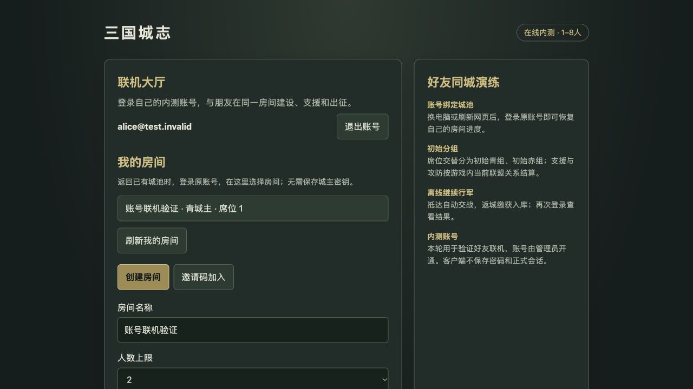

## 0.5.0 1–8人房间与席位恢复

2026-10-06。**1187项核心本地检查通过**（HTTP66＋SceneTree1121），另有**365项独立包审计通过**。实际Web创建/加入/满员恢复，macOS原生加入/20骑驻扎召回/重启恢复600可用轻骑，以及最终GodotWeb390大厅和同一战报粮草12000交付均已观察。

损坏JSON被覆盖的P1已修复，6种无效值均保留原字节；明确409拒绝后派遣等待文案残留的P2已修复，运输未确认仍禁止重复派遣。Windows/Web已最终导出，代码/启动入口/清单检查通过，最终PCK在macOS验证。**0.5.0为本地包，Windows EXE尚未在Windows运行，公网/Supabase/Steamworks未部署。** 大厅未确认登记只保留在当前窗口内存，请保持窗口并重试原请求；正式跨电脑后台仍待配置。

完整数据、最终包哈希和边界见 [房间报告](../production/polish/room-lobby-report-2026-10-06.md)，入口见 [房间说明](ROOMS.zh.md)。

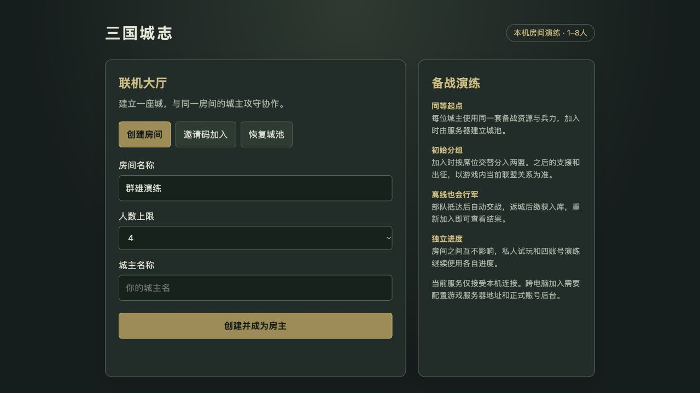

## 0.4.0 四账号共享攻防

2026-10-06。**1040项本地检查通过**：HTTP45、原生客户端/地图/战斗/事务/输入840、共享API89、共享UI49、实际Web回执存储17。修复同账号多窗口操作覆盖、身份切换残留、旧回执回退、进程旧锁恢复竞态与跨账号实体ID碰撞，独立复核通过。

真实macOS/Web已观察援军驻扎、自动战斗、双方一致战报、返程交付及召回。最后修复后重新加载最终Web导出，原持久进度与已交付战报正确；最新原生20长枪兵援军驻扎、召回和自动返城已观察。Godot Windows/Web最终导出、包内模块与清单审计、独立包内Node攻防烟测均通过。当前为本地包，**0.4.0未公开发布，Windows exe/CI尚未运行**；不能套用下面0.3.1的成功记录。完整证据、最终包摘要与边界见 [共享PvP报告](../production/polish/shared-pvp-report-2026-10-06.md)。

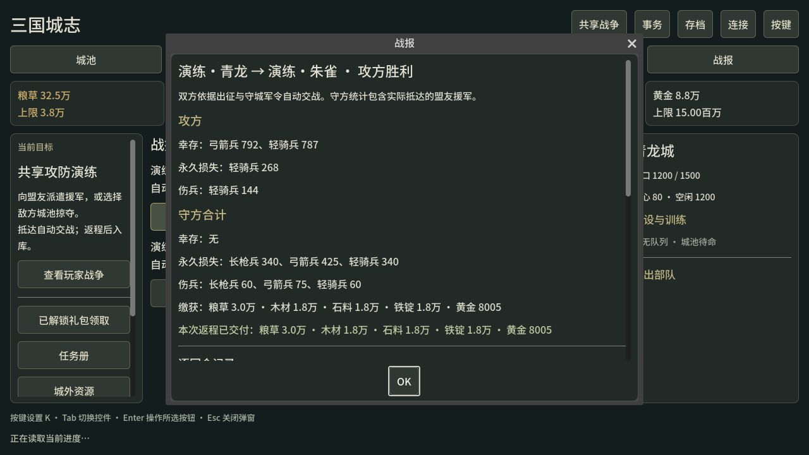

## 0.3.1 大地图测量与路线裁剪

2026-10-06，Godot `4.7.2.stable.official.ed1daf0bf`，标准版 GDScript。697 项本地与 Windows CI 检查、原生性能比较、最终原生／Web 观察、发布资产校验与正式 Windows 包运行验证均已完成，故事 004 为 DONE。本节记录0.3.1历史版本；以下 0.3.0、0.2.0 与更早结果均为历史证据。

### 实现与自动检查

长虚线按整条线与扩展视窗的交集生成可见 dash，从原起点计算相位，取消旧 600 段／约 9000 屏幕像素上限；内部双精度比例避免两百万像素线的端点误差。两端屏外仍可穿屏显示。行军每 50 ms 检查可见动态标记，屏外／筛选隐藏部队避免无用刷新；未来到达引用支持短行程或卡顿越过移动区间后的单次最终刷新，驻扎、采集和返回语义不变。

低于 46% 的远景使用原 y/x 顺序的城池／任务／主城稀疏索引，46% 及以上保持逐格细节；地形／森林／山峰颜色保持原值。纯坐标几何缓存每类上限 2048，缩放采用当前 pixels；河流保留原采样格、邻点、宽度与支流 `W/(3H)` 间距。山峰乘法顺序调整仅有极小浮点舍入差异，没有意图形状变化。

| 范围 | 通过数量 | 本轮证据 |
|---|---:|---|
| 桥接、地图、城池/战斗、客户端、事务与输入 | 482 | 根代理最终重新执行确认 |
| 新增几何、真实绘制、到达边沿与缓存 | 215 | 根代理独立复跑 `MAP_RENDER_TEST_CHECKS=215 failures=0`，无 ERROR |
| 合计 | 697 | 本地与 Windows CI 全部通过；源码推送、标签与正式包验证三项 CI 均 success |

新增检查使用隔离 DTO 与实际 SceneTree draw，覆盖长线几何、相位、可见候选量、连续动画、筛选、驻扎／采集、现有标签 margin、首次扫描前抵达、卡顿跨过到达、单次完成刷新、稀疏索引阈值／顺序／替换和缓存有界／坐标／缩放等价。根代理日志为 `.local/map-031-final-render.log`。独立源码复核无阻塞发现；源码导入无 ERROR。它们不连接规则服务或读写玩家存档，数学与 headless 回归不能代替性能捕获。

### 原生性能证据

三个原生非 headless 捕获均 valid，两份 comparison 均 matched，原始逐帧数据归档在 `production/polish/data/`。相同 Apple M1、macOS 27.0.1、Godot 4.7.2 debug、OpenGL compatibility、1280×800、VSync、限帧 60；各组热身 30／采样 150 帧。最终地图 SHA256 为 `4d0fbb443343438e77d6a9b9194a019dec0562fb0c88b0d0673cf0c21cc90179`，基准三次相同。完整数值与复现见 [报告](../production/polish/world-map-report-2026-10-06.md) 和 [说明](MAP-PERFORMANCE.zh.md)。

最终每次重绘 CPU p95：64_pan 17.543→16.626 ms、总览 72.376→37.163 ms、200 pan 22.133→19.645 ms、200 idle 23.175→18.710 ms。200 pan 每采样帧仍是两次重绘，其 CPU p95 为 43.986→39.144 ms。64_pan 帧间隔 p95 67.432→67.678 ms 略升，CANVAS calls 完全相同；单次 set_world 更贵，行军 process CPU 与引擎内存略增。第一轮三个 CPU 尾部回退的数据独立保留，随后代码优化得到 final 捕获，没有拼各轮最佳数据。

CPU draw 是插桩命令准备，分层时间属于其总量；帧间隔包含 VSync、渲染和调度，不是 GPU、完整 FPS 或输入延迟。引擎 static memory 不等于 RSS；GPU timing UNAVAILABLE。四项预算未设定、默认 enforce warn，符合性为 NOT ASSESSED — NO BUDGET。合成 256²／200 行军不是已扩州或 200 在线玩家，开发机捕获不是 Windows/Web 性能验证。

### 最终实际原生与 Web 观察

根代理在最终源码的 macOS 原生窗口保留原 userdata，拖动镜头 (32,32)→(40,36)，minus 缩到 41% 显示中原分区，H 回到 32，KP_Add 恢复 80%；选中河畔荒田后侧栏坐标 29,35、配兵出征按钮可见。此处只查看，未下达出征或经济命令。截图为 `map-performance-overview-native.jpg`、`map-performance-near-native.jpg`。

最终 `build/web` 在独立 17341 QA 服务完成 1280×800 桌面拖动、71% 近景、41% 总览、H 与 KP_Add 恢复 80%、同任务侧栏；截图为 `map-performance-near-web.jpg`、`map-performance-overview-web.jpg`。390×844 完成拖动、minus、H，镜头回到 32、缩放 71%，截图为 `map-performance-390-web.jpg`。浏览器 warn/error 日志为空。临时 QA tab 已关闭，viewport 已 reset；用户 17339 重新载入最终资产，原 `.local/play` 保留，原生客户端继续运行。未使用旧版截图代替本轮观察，窄屏不等于真实手机触控测试。

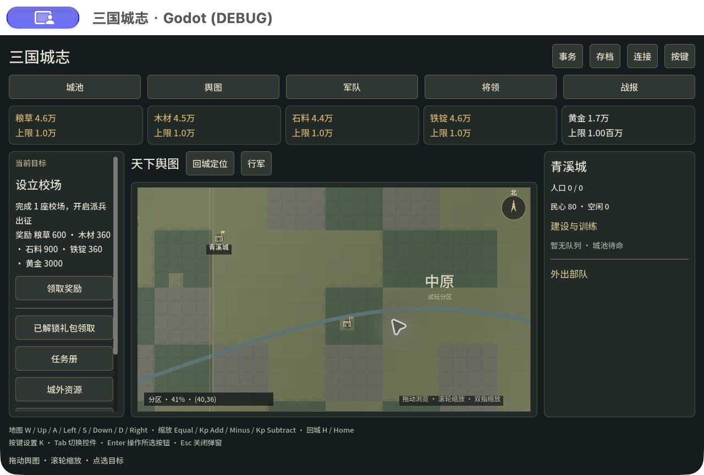

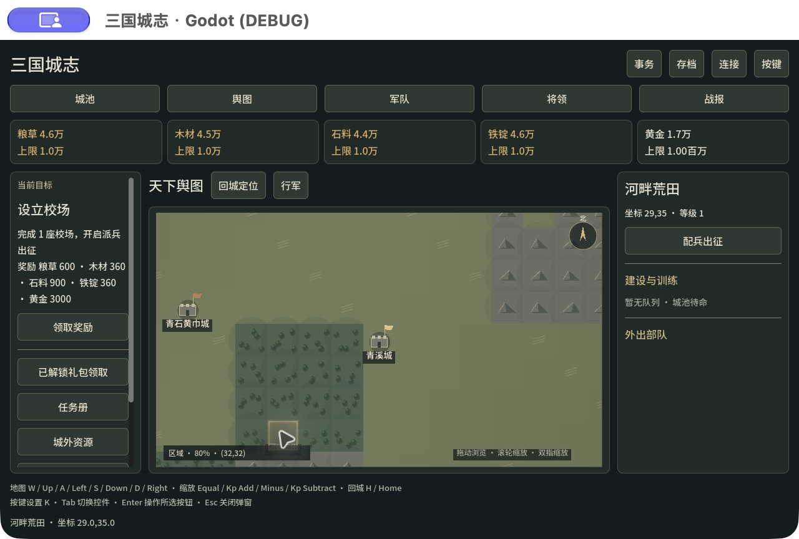

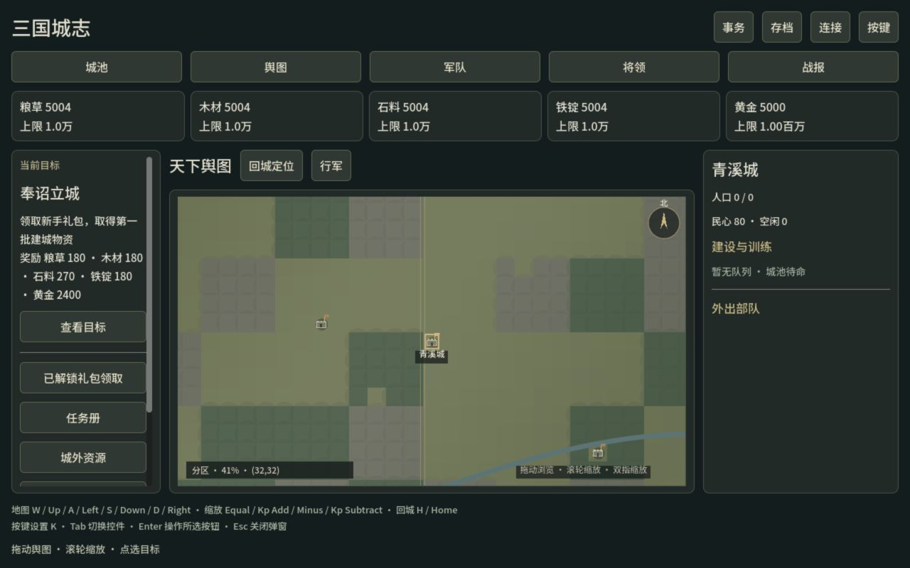

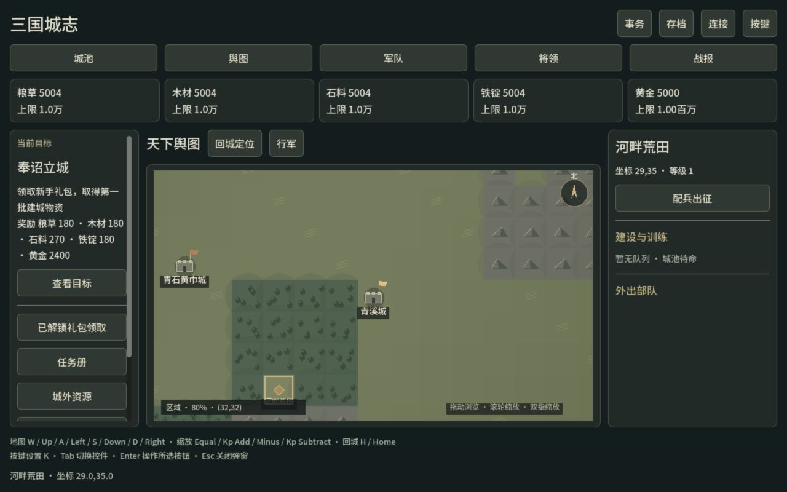

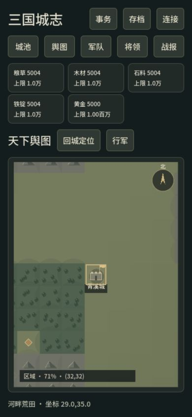

### 发布资产与 Windows 实际启动

Windows/Web 最终导出成功并发布至 [v0.3.1](https://github.com/YuJieMichael/three-kingdoms-godot/releases/tag/v0.3.1)，标签源码为 `ce131a8b62941cc537d2bc7398f247ad9b796d17`。根代理通过 GitHub API 核对下表四项资产的字节数及 digest 均与本地一致，记录为 `.local/release031-verified.json`。

| 文件 | 字节数 | 本地与 GitHub 一致的 SHA256 |
|---|---:|---|
| ThreeKingdoms-Godot-v0.3.1-Windows-x64.zip | 86869201 | `84d15f246bb440e2fb895960adc198464c293cf8aefea4fe62b827f3be7913c6` |
| ThreeKingdoms-Godot-v0.3.1-Web-preview.zip | 59029064 | `78659bb2f6c634124afc214333aec5b7a6422e95a7c3fec79e8ecef587fb3e91` |
| build-manifest.json | 629 | `ac796ae78746148f0357889dffe011d326146bbd6ab4fa3c721ad8c6df26c19a` |
| SHA256SUMS.txt | 218 | `0f005505c0974d5a1022edc747fe915ba76e8c5f90cb4701e52e689219a04736` |

[源码推送 CI](https://github.com/YuJieMichael/three-kingdoms-godot/actions/runs/37479201825)、[标签 CI](https://github.com/YuJieMichael/three-kingdoms-godot/actions/runs/37479270820) 与 [正式 Windows 包下载／校验／启动验证](https://github.com/YuJieMichael/three-kingdoms-godot/actions/runs/37479418934) 均 success，head 均为 `ce131a8b62941cc537d2bc7398f247ad9b796d17`。正式包验证日志 `.local/windows031-ci.log` 确认桥接 22、world 24、battle 31、client 71、management 79、input 255、map render 215，共 697 项通过，`MAP_RENDER_TEST_CHECKS=215 failures=0`。源码 smoke 与 `Verify exported Windows executable` 均收到 `GODOT_SMOKE_OK canonical_revision=0 tiles=4096`。正式发布 ZIP 下载后通过 SHA256 校验，解压后实际执行 `ThreeKingdoms.exe --headless -- --smoke`，连接随包规则服务并载入权威状态与地图；这不代替 Windows 桌面人工长局或目标平台性能测量。

规则来源仍为 c7674df，runtime hash 为 `432f9fea6359c18a8d1e2655b09f97770718c3e676501c602c7897afd906a8b4`；vendor/legacy 与 bridge 无差异，原仓库工作区干净、HEAD 仍 c7674df，原 Pages 未部署。Graphify 按原 code-only 排除 flags 与 `cluster-only . --no-label` 刷新，为 573 节点、1712 边、30 社区；`.gd` 仍未覆盖，只有本地图谱更新，没有外部语义后端、watcher、hook 或上传。

动态 Canvas 分层、图集、正式美术、规则扩州和极长标签实际字体边界裁剪不在本轮，目前仍沿用左右 120、上下 35 px 标记 margin。缓存整体清空与定期快照的长局尾部、Windows 人工长局、真实手机、手柄、Steam Deck、Steamworks、公网多人及其压力表现未验证。

## 0.3.0 可配置电脑输入更新

2026-10-06，Godot `4.7.2.stable.official.ed1daf0bf`，标准版 GDScript。以下为根代理已执行与观察的本轮证据；0.2.0 与 0.1.1 记录保持为历史版本。0.3.0 实现、本地检查、macOS 原生操作、实际 Web 桌面/390 窄屏、最终 Windows/Web 导出与发布、正式 Windows 发布包启动 CI 均已完成，故事 003 为 DONE。

### 自动检查

| 范围 | 通过数量 | 本轮重点 |
| --- | ---: | --- |
| 真实 HTTP 桥接 | 22 | 重新验证原规则、事务费用、权威回执、持久化与隔离 |
| 原生地图 | 24 | 重新验证相机边界、拖动/缩放与行军语义 |
| 城池/战斗表现 | 31 | 重新验证建筑、军令与回合反馈 |
| 客户端 | 71 | 重新验证布局、状态保持、命令顺序与重连 |
| 原生城池事务 | 79 | 重新验证实际报价、回执刷新和桌面/窄屏管理表单 |
| 可配置输入 | 255 | 绑定校验、保存与失败回滚、损坏配置、真实事件导航、键盘地图和焦点隔离 |
| **总计** | **482** | 根代理独立运行确认全部通过 |

Godot 源码解析通过，未出现 ERROR。输入检查注入生产客户端的真实输入事件，并使用可丢弃的独立用户目录与 transport probe；未读写玩家进度。覆盖重复及原生 UI 保留键拒绝、带修饰组合、重新读取绑定、保存失败保留旧映射、损坏配置完整回退、原生 `ui_*` 不变、同帧按下/释放、WASD 与方向键、反向键抵消、地图边界和缩放锚点、按钮焦点、LineEdit/TextEdit/SpinBox、弹窗、失焦及 390 像素设置布局。导航和设置操作未发送经济或玩法命令。

CI 已执行 `tests/input_test.gd`，本轮 Windows 日志确认 `INPUT_TEST_CHECKS=255 failures=0`、`MANAGEMENT_TEST_CHECKS=79 failures=0`，其余原有检查亦通过。自动检查确认事件路由与布局边界，不代替实际桌面/网页观察。

### 实际 macOS 原生操作

在非 headless Godot 窗口中真实操作：

- 用 K 打开按键设置，将“查看城池”绑定为 2 时显示冲突并拒绝，原绑定保留。
- 改为 F9 后提示已保存；正常关闭客户端并重新启动，F9 成功切换城池，确认客户端绑定跨启动恢复。随后通过界面恢复默认 1，切换城池成功。
- 原方向键曾被 Godot GUI 焦点导航消费；调整为地图获得焦点时在 GUI 前路由后，Right 短按使镜头 32→34，小键盘加号使缩放 80→90，H 返回主城。其他控件仍保留原生焦点导航。

最终恢复默认后用 K 打开设置，截图为 `docs/screenshots/pc-input-settings-native-final.jpg`。此轮只读页面与本机按键设置，不执行经济命令，不导入测试进度覆盖玩家存档。其他截图为 `pc-input-conflict-native.jpg`、`pc-input-settings-native.jpg`、`pc-input-map-native.jpg`。

### 实际 Web 观察

最终导出版本使用临时 17341 端口进行独立 Web 输入验证：

- 存档 TextEdit 输入 `12345k` 时未触发页面或设置快捷键；Esc 关闭后立即按 2，无需额外点击就成功进入舆图。截图为 `docs/screenshots/pc-input-text-web.jpg` 和 `pc-input-focus-web.jpg`。修复弹窗关闭后的焦点恢复，避免已隐藏的存档编辑器继续拦截快捷键；新增检查覆盖同样的真实事件链路。
- H 回城，按 `=` 使缩放 80→90%，按 D 六次使镜头 32→38，地图位置变化可见；截图为 `pc-input-map-web.jpg`。
- 390×844 窄屏顶部隐藏按键按钮，仍可通过“事务→按键设置”进入。350 像素宽的弹窗完整容纳内容，滚动可查看 15 项及恢复默认/关闭按钮，并实际点击恢复默认；截图为 `pc-input-settings-390-web.jpg` 和 `pc-input-settings-bottom-390-web.jpg`。
- 最终浏览器 warn/error 日志为空。

窄屏使用实际浏览器视口尺寸验证，未进行真实手机多点触控。本轮未执行经济命令，也未用测试存档覆盖玩家进度。

### 导出产物

官方 Windows 与 Web 模板均导出成功，包内包含 Node Windows 24.21.0、规则服务、游戏资源与许可证。构建脚本仍在导入前生成 `build/.gdignore`。最终包清单：

| 文件 | 字节数 | SHA256 |
| --- | ---: | --- |
| ThreeKingdoms-Godot-v0.3.0-Windows-x64.zip | 86865047 | `8bf0128405e096e4dbf2f66ae0208d23e4fa7d0cc99681102e2f0fda98798c98` |
| ThreeKingdoms-Godot-v0.3.0-Web-preview.zip | 59024910 | `3546e8bdd267210a18d421ffd07e0e8762faafedc2e1565c56f7f3a553e41945` |

`build/build-manifest.json` 与 `SHA256SUMS.txt` 同时生成，规则来源仍为 `c7674df45b9595405e57907524e737e633b0ff63`，canonical runtime hash 保持 `432f9fea6359c18a8d1e2655b09f97770718c3e676501c602c7897afd906a8b4`。本轮只修改独立 Godot 仓库；不更改 vendor/legacy、原仓库或原 GitHub Pages，不启用 watcher、hook 或图谱上传。

### 发布与运行边界

[v0.3.0 预览发布](https://github.com/YuJieMichael/three-kingdoms-godot/releases/tag/v0.3.0) 已创建，标签与源码指向 `3a48bf5df20a708199f3c69a1a0409c8cadac92a`。两个 ZIP 的 GitHub digest 与上表一致；清单文件 `build-manifest.json` 的 SHA256 为 `0993f3a370c8c4877678a005ddf02483769d8880dcd04ac78d54767d29e244aa`，`SHA256SUMS.txt` 为 `64dc51d84f186fec83a5830bff1e269918dedefbc23aae3203a3520f606b499f`，四项发布资产 digest 均与本地核对一致。

[Windows CI 运行](https://github.com/YuJieMichael/three-kingdoms-godot/actions/runs/37472454474) 在同一源码提交全绿。官方 Godot 安装与校验、导入、全部原生 GDScript 检查、源码客户端 smoke 和 `Verify exported Windows executable` 均 success。正式发布 ZIP 下载并核对 SHA256，解压后直接执行 `ThreeKingdoms.exe --headless -- --smoke`，收到 `GODOT_SMOKE_OK canonical_revision=0 tiles=4096`。这确认正式 Windows 导出包能启动、连接随包规则服务并载入权威状态与地图，不等于 Windows 桌面人工长局或 Steam 成品验证。

原仓库工作区、HEAD 与远端均经根代理确认保持 `c7674df45b9595405e57907524e737e633b0ff63`，未发布原 Pages。临时 17341 QA 服务已关闭，本机玩家 17339 与原生客户端继续运行。

本轮未测得性能 FPS 基线，未验证 Windows 人工长局、真实 iPhone 多点触控、手柄、Steam Deck、Steamworks、公网账号/共享世界或百人压力。按键设置的浏览器用户目录与原生用户目录分离，不提供跨设备云同步。

### 本地图谱与复核

独立代码复核通过，未发现阻塞缺陷。Graphify 沿用 `extract . --code-only --exclude '.claude/**' --exclude 'docs/engine-reference/**'` 和 `cluster-only . --no-label` 完成最终刷新，为 553 节点、1662 边、29 社区；没有外部语义后端、上传、watcher 或 hook。Graphify 0.9.76 不识别 `.gd`，IIFE 图谱覆盖仍不完整，Godot 输入实现以源码、真实 SceneTree 和运行证据为准。

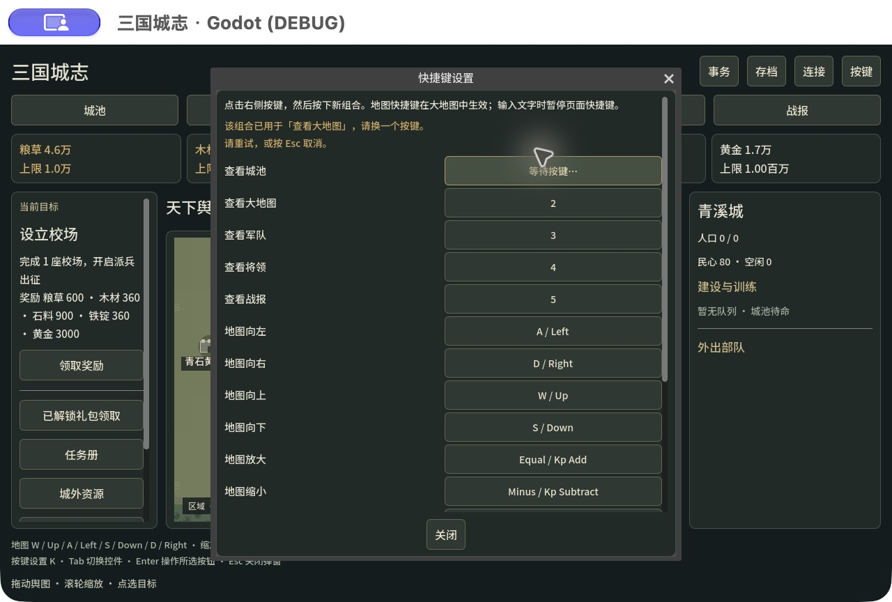

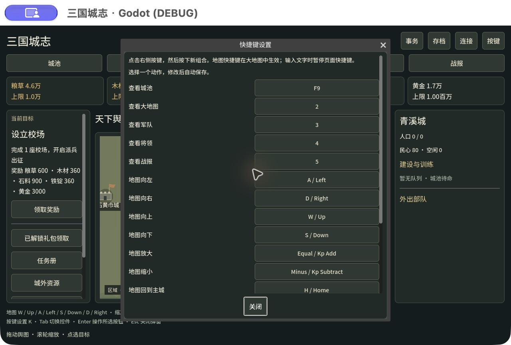

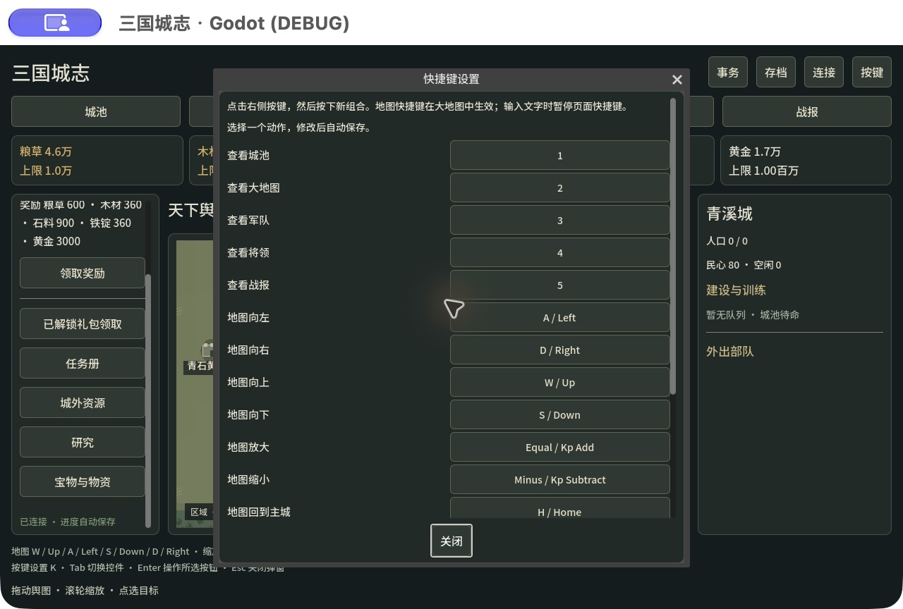

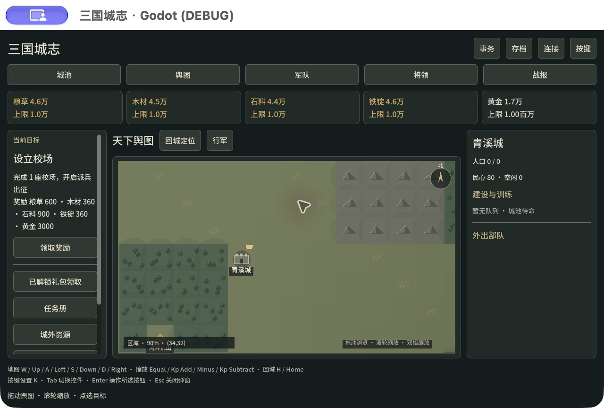

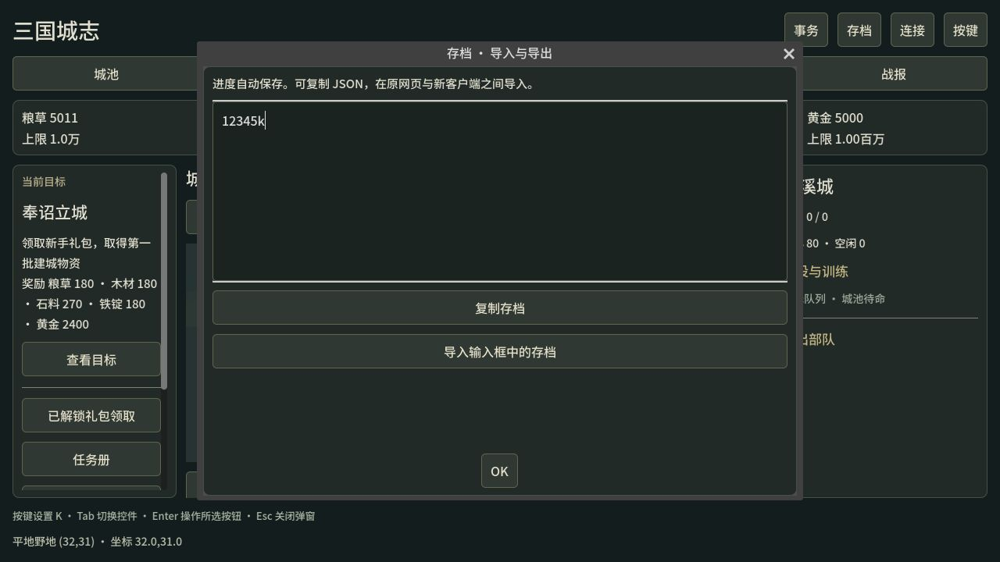

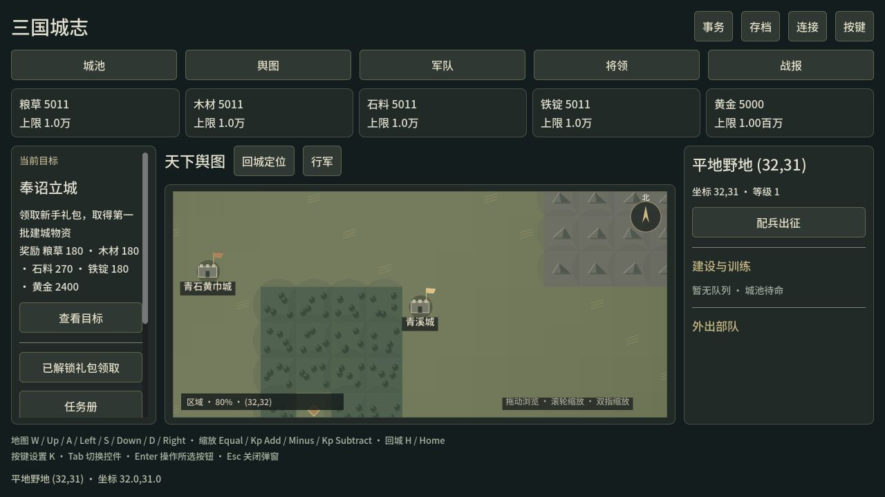

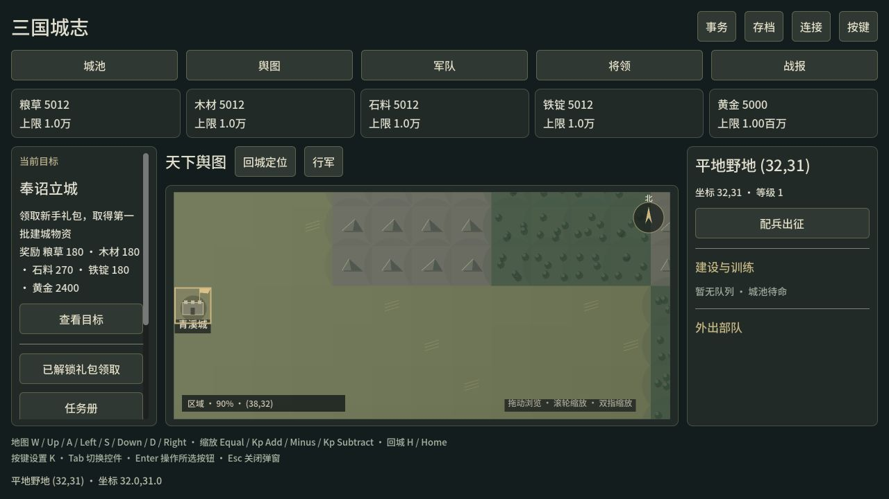

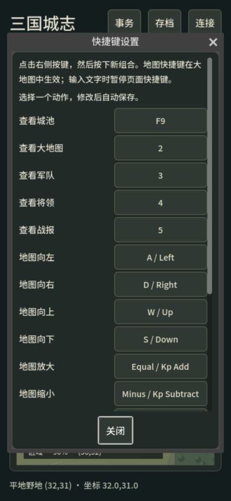

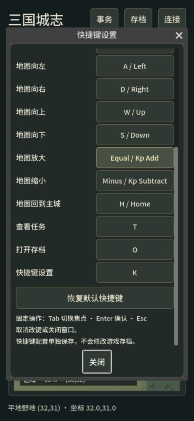

## 0.2.0 城池经营更新

2026-10-06，Godot `4.7.2.stable.official.ed1daf0bf`，标准版 GDScript。0.2.0 本地检查、实际网页经营验证与 macOS 原生面板观察已通过；Windows/Web 包已发布，正式 Windows 导出包 headless 启动 CI 通过。以下 0.1.1 的 CI 链接属于历史版本，本次运行证据单独记录。

### 自动检查

| 范围 | 通过数量 | 本轮重点 |
| --- | ---: | --- |
| 真实 HTTP 桥接 | 22 | 满仓交易、黄金与交易上限、税率与忙碌城守、招募费用及两类俘将占位、多城经营范围、跨重启回执 |
| 原生地图 | 24 | 继续验证相机、拖动/缩放、隐藏任务据点和行军语义 |
| 城池/战斗表现 | 31 | 继续验证建筑、军令与回合表现、窄屏日志布局 |
| 客户端 | 71 | 继续验证布局、地图状态保持、命令顺序、持久未确认请求与重连 |
| 原生城池事务 | 79 | 市场数量实时预览和提交、城守/税率、客栈、等待回执与刷新、电脑/窄屏和事务奖励换行 |
| **总计** | **227** | 根代理独立执行并确认通过 |

Godot 导入通过；构建脚本在导入前生成 `build/.gdignore`，避免递归导入此前导出的资源。CCGS 按 minimal 工作流显式执行验证；本地辅助资料未启用 hook 或 watcher，且不进入 Git 提交或导出包。

### 实际网页观察

IAB 浏览器实际加载 Godot WebAssembly 客户端，在 1280×720 / DPR 2 与 390×844 / DPR 1 完成三类经营界面和事务入口操作。这是浏览器窄屏验证，尚未进行真实 iPhone Safari 或多点触控测试。

使用独立合法虚构存档设置市场 2 级、客栈 2 级、招贤馆 4 级与民房 2 级。观察并经权威快照核对：

- 满仓粮草 10000 / 上限 10000，黄金 50005。输入 `999999` 时，实时成交预览和提交数量收敛到 50005；买入后粮草 60005、黄金 0，资源完整超仓入库。随后卖出 10000，粮草 50005、黄金 10000。操作后面板更新实际余额。
- 客栈打听不扣黄金，显示徐晏（3 级、3000 黄金）和夏松（2 级、2000 黄金）。招募徐晏后黄金 7000、已用房间 3 / 4、将领列表 3 人，属性来自原规则。
- 任命林朔为城守，面板显示城外生产和建设系数 1.48；税率调整为 30%，民心目标 70、显示黄金收入 0.84 / 分钟。
- 后端快照 revision 7 确认上述交易、招募、任命与税率已保存。重新加载后仍显示同一进度（粮草 5.0 万、黄金 7009；期间正常时间收入继续结算）。
- 窄屏市场、城守/税率、客栈均可滚动操作；事务菜单完整容纳入口，任务描述与奖励换行。浏览器 error/warn 日志为空。

截图保留于 `docs/screenshots/management-*.jpg`，包括电脑与窄屏三类表单、事务菜单、城池和将领表。本轮测试没有读取或覆盖玩家原网页存档，`.local/play` 新城进度保持独立；虚构经营存档仅验证操作与规则衔接，不作为自然成长节奏或经济平衡结论。

### 构建与桌面运行边界

官方 Windows 与 Web 模板均导出成功，包内包含 Node Windows 24.21.0、规则服务、游戏资源与许可证，规则快照保持 `c7674df45b9595405e57907524e737e633b0ff63`。本次产物清单：

| 文件 | 字节数 | SHA256 |
| --- | ---: | --- |
| ThreeKingdoms-Godot-v0.2.0-Windows-x64.zip | 86844832 | `d479679ea49c4e15ba17ddce66a97c591116e216853fd6109df99f81eb1df3ff` |
| ThreeKingdoms-Godot-v0.2.0-Web-preview.zip | 59004695 | `f4175dd8d0d24de44a9db50d7636c1118b85556533df35fc66d637bcb653b8cc` |

`build/build-manifest.json` 与 `SHA256SUMS.txt` 同时生成。canonical runtime hash 仍为 `432f9fea6359c18a8d1e2655b09f97770718c3e676501c602c7897afd906a8b4`，原网页仓库 HEAD 不变、工作区干净，没有修改或部署原 Pages。

本机非 headless Godot 客户端已启动，日志确认 OpenGL / Apple M1 和本地规则服务就绪，未出现脚本错误。macOS 原生桌面窗口已实际观察：城池场景与经营入口可见，市场、城守/税率和客栈三个面板均只读打开检查，未执行交易或更改桌面存档；原生截图保留为 `docs/screenshots/management-city-native.jpg`。导出成功、headless 启动、人工桌面交互试玩和长期体验分别记录。

### 0.2.0 发布与 Windows 实际启动

[v0.2.0 预览发布](https://github.com/YuJieMichael/three-kingdoms-godot/releases/tag/v0.2.0) 源码与标签均指向 `aa963a8d7584103595983896d8681d2b59e8bfc1`。GitHub 上两个 ZIP、`build-manifest.json` 与 `SHA256SUMS.txt` 四个资产的 digest 均与本地产物一致。

[Windows CI 运行](https://github.com/YuJieMichael/three-kingdoms-godot/actions/runs/37467149603) 在同一提交完成并全绿：真实桥接检查、Godot 导入与原生脚本检查、源码客户端启动以及 `Verify exported Windows executable` 均 success，CI 亦确认上述 227 项全部通过。发布包步骤从正式发布下载 Windows ZIP，核对 SHA256，解压后直接运行 `ThreeKingdoms.exe --headless -- --smoke`，连接随包本地规则服务，收到 `GODOT_SMOKE_OK canonical_revision=0 tiles=4096`。这确认正式导出包可以启动并载入权威状态与地图，不等于 Windows 人工长局或 Steam 成品验证。

Steamworks、公开账号/共享世界、百人压力测试、真实手机触控、Windows 人工长局、控制器与 Steam Deck 均未验证。原游戏完整名将/招降、联盟、计谋、其它城池管理及正式美术继续迁移；PC 开发后续顺序见 [PC 工作流](PC-GAMES.zh.md)。

### 本地图谱

沿用 `extract . --code-only --exclude '.claude/**' --exclude 'docs/engine-reference/**'`，再 `cluster-only . --no-label`。本轮刷新后为 553 节点、1662 边、29 社区。没有外部语义提取、上传、watcher 或 hooks。Graphify 0.9.76 未识别 `.gd`，引擎 IIFE 覆盖亦不完整；原生界面关系继续核对源码和真实 SceneTree，图中缺少节点不代表没有依赖。

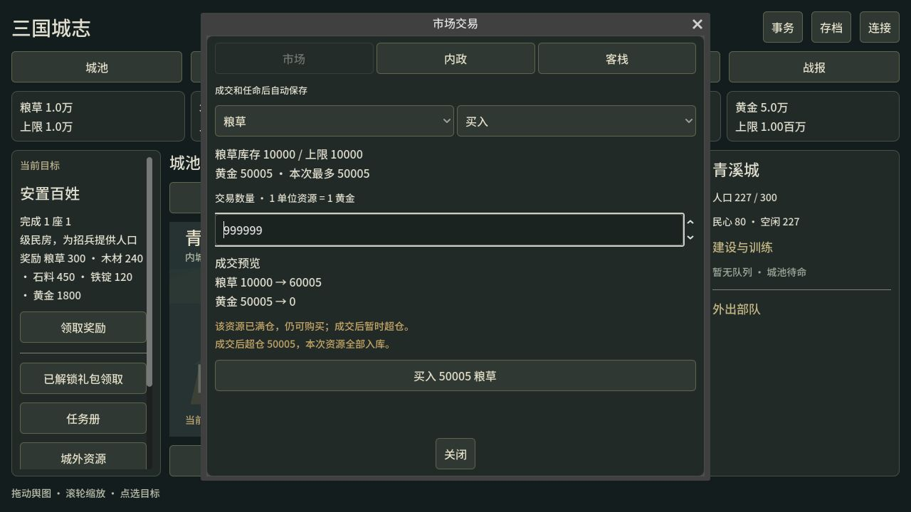

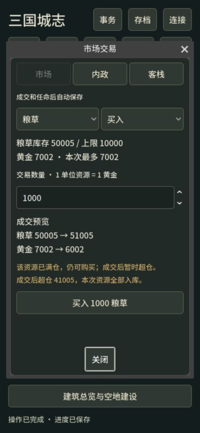

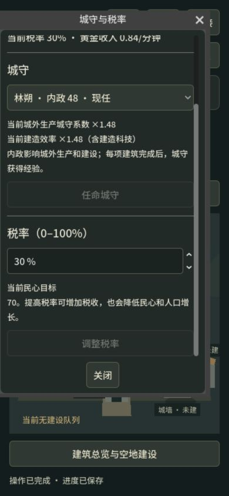

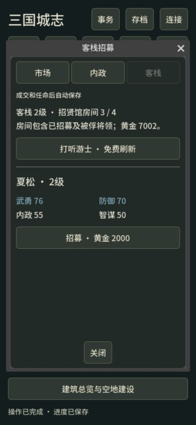

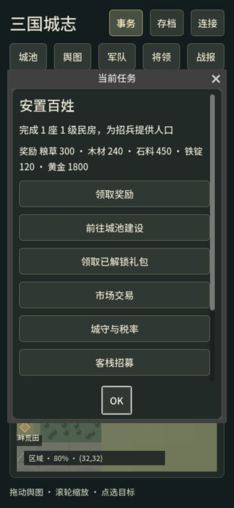

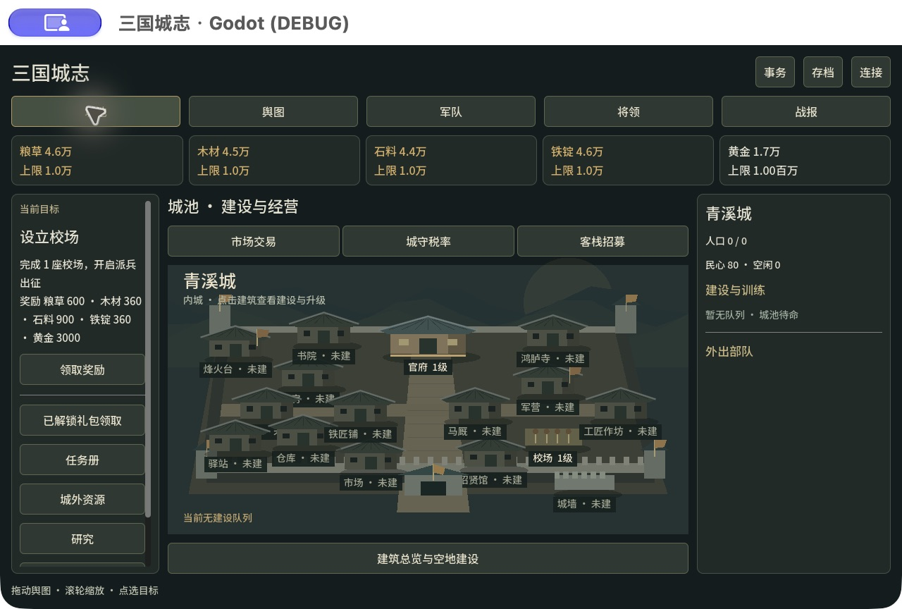

## 0.1.1 历史验证记录

2026-10-06，Godot `4.7.2.stable.official.ed1daf0bf`，标准版 GDScript。

0.1.1 修正变量字体的整数轴标签，实际渲染坐标确认字重 500；新增直接读取 TextServer 字体坐标的回归检查。初版建设/行军/战斗链路截图保留，当前新城与手机截图已更新为 0.1.1。

### 已完成

- 原仓库 HEAD `c7674df45b9595405e57907524e737e633b0ff63`，工作区干净；没有修改或部署原 GitHub Pages。
- 15 个真实 HTTP 桥接集成用例通过：CAS 并发、重复编号回执跨重启、只读时间投影不重复结算、建筑/训练/真实混编行军、战斗胜利及一次结算、随机加速不重抽、存档迁移/损坏保护、Origin/token/文件隔离。
- 24 个地图检查通过：屏幕/世界坐标、相机边界、拖动阈值、锚点缩放、触屏手势、分区配置、隐藏未来任务据点、行军/驻扎时间语义。
- 31 个城池/战斗表现检查通过：实际建筑等级、军令转发、回合事件动画、旧回合不重复播放、真实主题下窄屏双列按钮不重叠、日志布局。
- 71 个客户端检查通过：1280 与 390 宽度、1280×720 的高度/页脚/侧栏滚动、手机军队末尾按钮可达、资源更新保持地图实例和视角、战斗命令依次使用新 revision 与 sourceCity、持久 pending、同 authority 原编号重试、另一存档禁止重放、401 与请求在途重连、成功清回执、409 刷新。
- macOS 实际运行 Godot 场景并连接自动启动的本地规则服务，收到 `GODOT_SMOKE_OK`，4096 个地图格来自原规则。
- 官方 Windows 与 Web 模板导出成功；打包包含 Node Windows 24.21.0、规则服务、完整资源、许可证和校验清单。下载工具先验证官方 SHA512/SHA256。
- 实际 IAB 浏览器运行 WebAssembly 原生客户端；1280×720 / DPR 2 与 390×844 / DPR 1 验证。修复 Web 高分屏逻辑尺寸、较矮窗口侧栏溢出和手机军队入口不可达。点选、拖动、滚轮缩放、礼包领取、民房建设、配兵出征与真实到达倒计时已操作。战场重新加载恢复，连续两回合战斗胜利自动结算；战报确认损失弓箭兵 2、幸存 998、实际入库粮草 429 / 木材 117，以及俘虏士兵。控制台未出现脚本错误。

### 发布验证

Windows GitHub Actions 源码验证通过：[运行记录](https://github.com/YuJieMichael/three-kingdoms-godot/actions/runs/37421609588)。从本次发布下载 Windows ZIP、核对 SHA256、解压、直接启动导出的 `ThreeKingdoms.exe --headless -- --smoke`，实际运行成功并连接随包规则服务，收到 `GODOT_SMOKE_OK`：[发布包运行记录](https://github.com/YuJieMichael/three-kingdoms-godot/actions/runs/37421796832)。导出成功和 headless 启动不等于 Windows 桌面交互试玩已完成。

### 测试边界

浏览器战斗使用本仓库 `.local/qa-web` 的虚构进度：校场与弓兵由合法测试存档导入，用于检查 UI→规则→战场→战报链路，不作为新手成长速度或资源平衡结论。没有读取、导入或覆盖玩家原网页存档。

尚未进行真实 iPhone Safari 多点触控、Steamworks、百人压力测试、公网账号/共享世界部署或自然长局平衡测试。程序绘制美术为迁移试玩资源，原游戏其它界面仍需继续迁移。

### 本地图谱

沿用 `extract . --code-only --exclude '.claude/**' --exclude 'docs/engine-reference/**'`，再 `cluster-only . --no-label`。553 节点、1667 边、32 社区，无外部语义提取、上传、watcher 或 hooks。

Graphify 0.9.76 当前未识别 GDScript `.gd`；生成的图主要覆盖规则快照与 Node 桥接，原引擎 IIFE 内部仍覆盖不足。Godot 场景关系以 `scenes/main.tscn` 与 `src/*.gd` 源码、真实 SceneTree 验证为准，图中不存在节点不代表没有依赖。

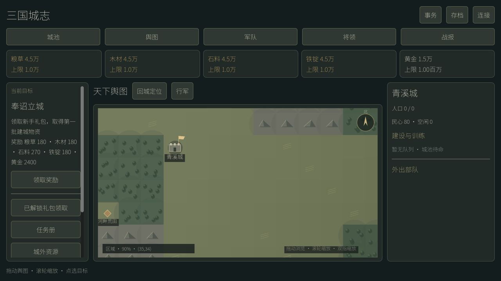

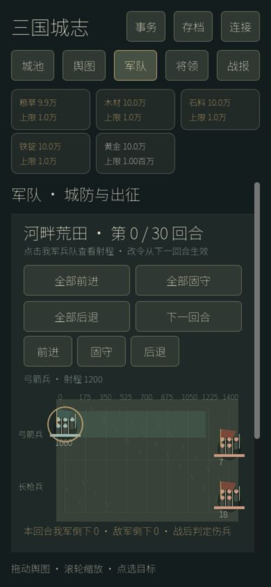

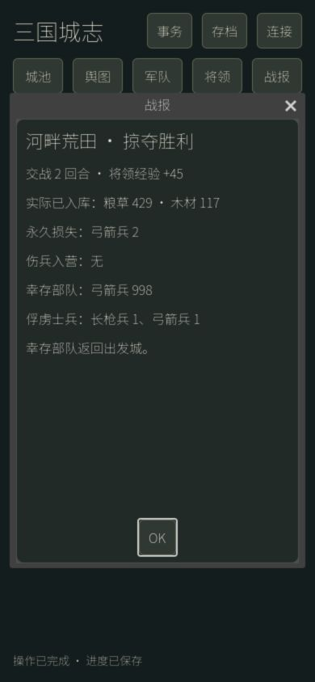

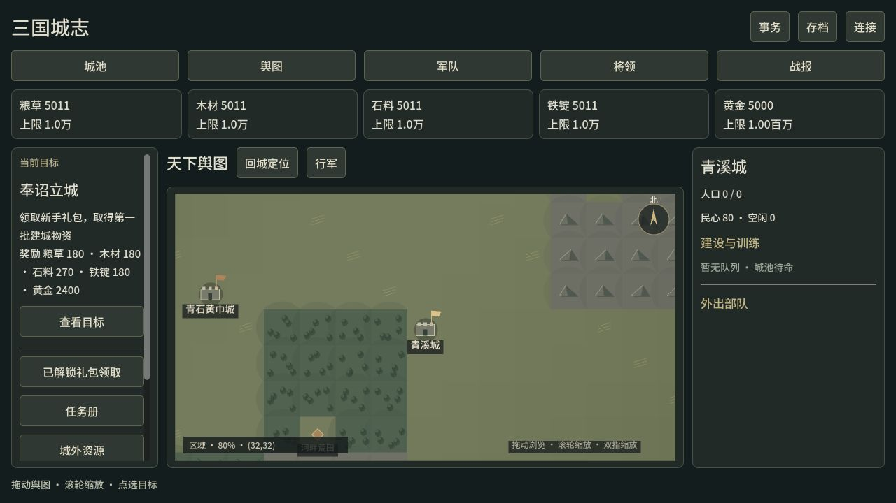

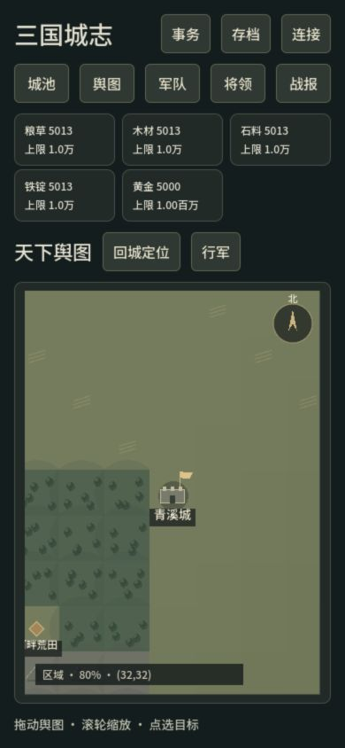
