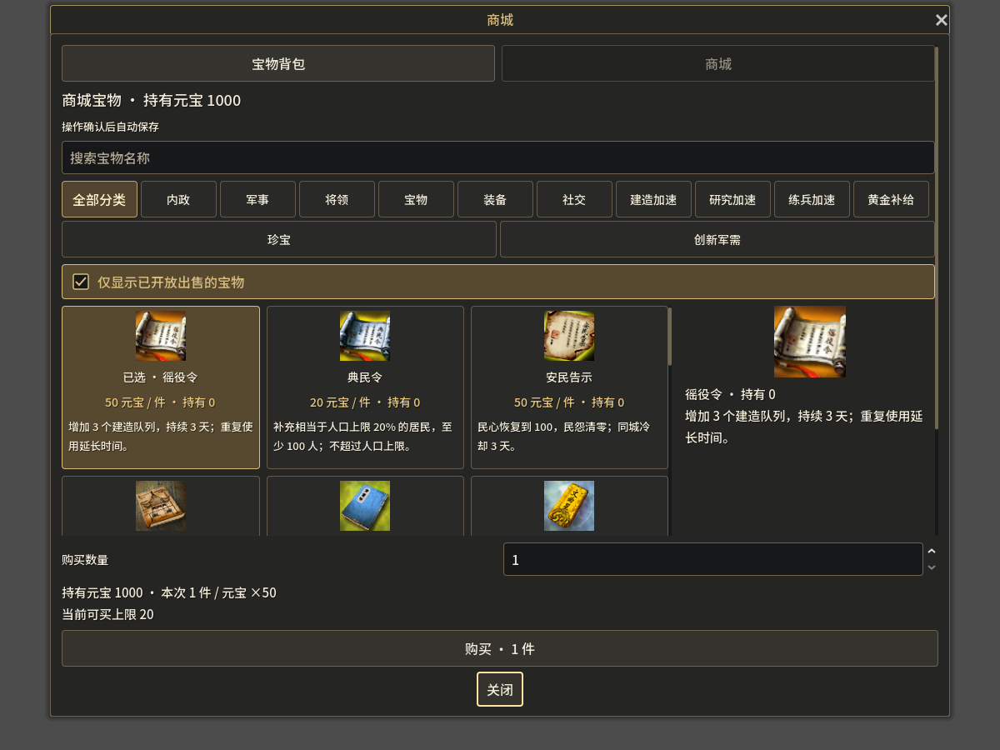
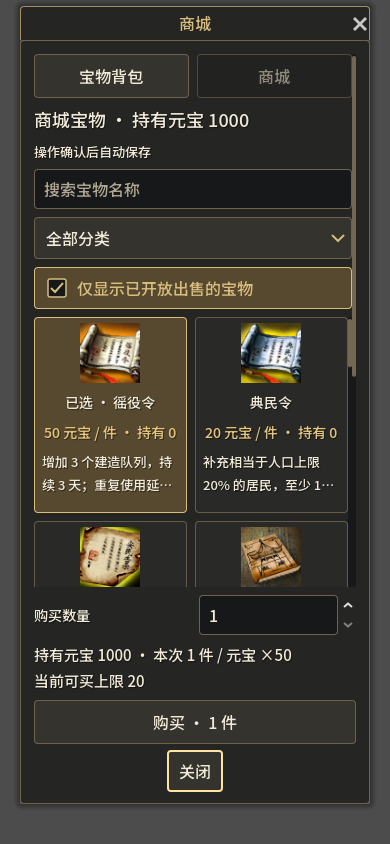
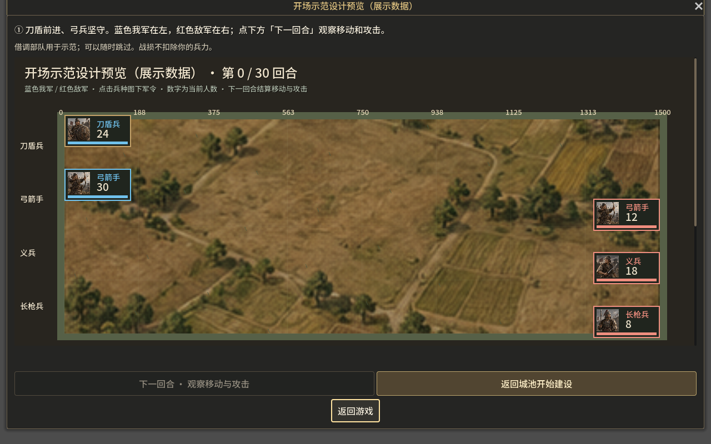

# dev.16 图标商城与开场示范战

## 商城

商城不再是商品下拉列表。桌面采用分类货架、右侧详情及底部购买区；窄屏采用分类选择和两列货架。商品显示图片、名称、元宝单价、已持有数量和简要效果；点选后查看完整用途。窄屏选商品会滚动到详情。

底部可以调整购买数量，查看总价、可买上限和金砖／军需限购剩余。确认购买仍使用现有报价与规则指令。图片也接入已持有宝物背包。未持有的背包道具继续隐藏。

82个道具映射77张原始PNG，来自用户提供的 `D:/APMServ5.2.6/www/htdocs/images`。旧道具名称与编号通过 `cfg_goods.MYD` 的名称字段及 `GoodsFunc.php` 注释对应，未运行旧PHP或EXE。只复制使用的图片，不复制用户数据库或账号文件。来源记录见 `assets/items/classic/PROVENANCE.json`，实际对应表见 `data/item-art.json`。这是备份中的旧版美术，与前两版自主生成素材区分。

长时练兵加速、创新军需包等试玩变体共用相应旧图标；它们的名称、时长及实际内容另外显示。图标复用不代表试玩变体曾存在于原版。道具说明参照 [4399商城宝物图鉴](https://web.4399.com/rxsg/yxjp_03_22954.html)，实际效果、价格和限购仍以本项目现有规则为准。

## 开场示范战

- 未完成自主首战、胜场为0、没有进行中的战斗／行军的本机存档，首次进入本版会直接开始刀盾护弓示范。
- 使用已有隔离借调会话：我方24刀盾、30弓兵；敌方18义兵、8长枪、12弓兵。兵种属性、移动、射程和结算由原规则执行。
- 开始时刀盾前进、弓兵坚守。顶部提示按回合讲解阵型、射程和军令，玩家手动点击下一回合；固定按钮等动画展示完毕再启用。
- 示范采用紧凑兵队卡，首屏能看到五支示范兵队。结束后显示战术复盘，可进入城池建设指导；也可随时跳过。
- 完成或跳过状态按本机进度身份保存于 `beginner-guide.cfg`，不修改正式首战完成条件。演练损失和收益不进入玩家城池。
- 已有进度也可从菜单打开“开场示范战”，原三种战术演练保留。

## 检查范围

已完成Godot脚本编译及Windows/Web导出，并渲染1200×900商城、390×844商城和1280×800默认窗口开场示范战设计预览。预览使用明确的展示数据，没有提交购买、演练或正式游戏指令，不写玩家进度。本轮未新增或运行功能测试，购买扣款、首次自动打开、逐回合引导和跳过记忆仍需实际试玩。

