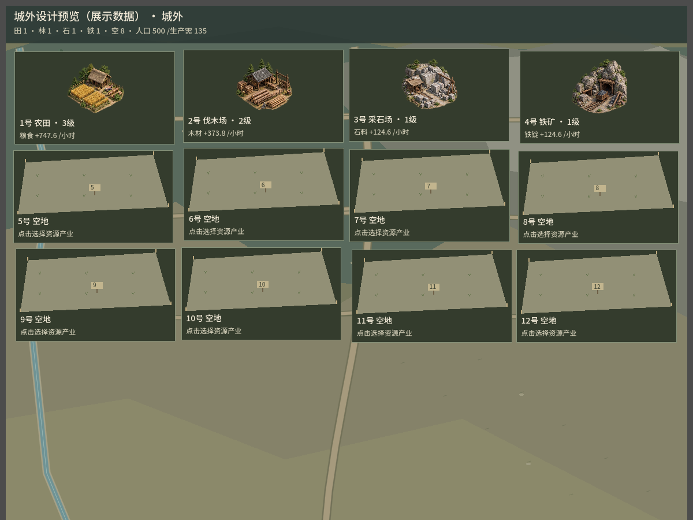
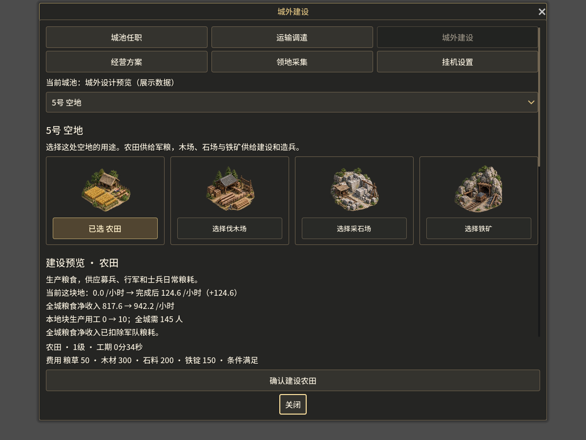
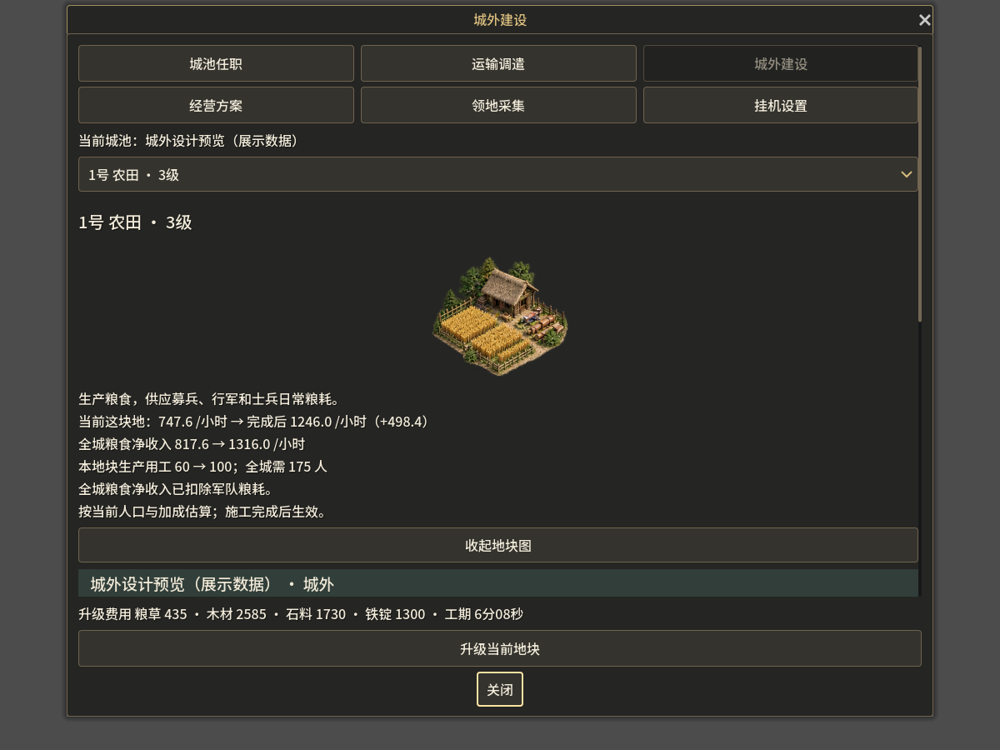
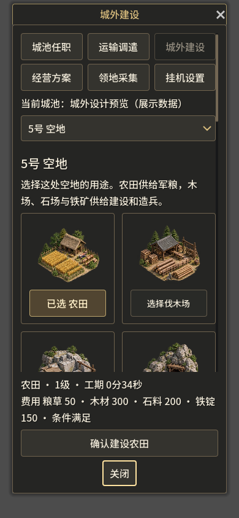

# dev.15 城外资源田与收益预览

针对城外只有文字、看不见建筑、看不懂建设作用的反馈。

## 已修改

- 城外入口与任务导航直接打开资源田场景，真实地块按编号排列。农田、伐木场、采石场和铁矿各有图片；空地保留空地标记。
- 地块卡片显示实际建筑、已完成等级、当前每小时产量。施工单独标记，不提前显示新等级或增加收入。
- 点空地看到四种资源建筑，先选择用途，再查看所选建筑的收益、费用和工期；点击底部确认才提交原有 `developPlot` 指令。
- 建设／升级详情显示单块地的当前与预计产量、增量、全城对应资源净收入、生产用工和总用工需求。
- 预计收益读取原规则的 `plotYield`、科技、领地、城池与人口系数；新用工需求会影响其他田地的产量。全城粮食净收入包含原规则军队粮耗。
- 人口不足、仓库已满时直接说明。预测按当前人口估算，施工期间的人口增长与其他队列完成可能改变实际结果。
- 费用与确认操作固定在底部。桌面建筑目录四列，窄屏两列；图片和收益说明可滚动。城外建设窗口中的地块图默认展开。

## 素材

资源田图集复制自用户原项目生成的 `assets/realistic/buildings.png`，PNG 未改动；Godot 用 AtlasTexture 读取第一行前四格。不是官方《热血三国》美术。来源、原始提示词与格位记录在 `assets/environment/suburb/PROVENANCE.json`。

## 检查范围

已完成 JS 语法检查、Godot 脚本编译、Windows/Web 导出，以及 Godot 桌面 1200×900、窄屏 390×844 的静态设计预览。预览使用明确标注的展示数据：四种已建资源田、人口500及空地，不写入玩家存档，也不提交建设指令。

本轮未新增或运行功能测试，未验证完整的新建、升级、施工完成和入库流程；导出成功不等同于成品客户端完整试玩通过。

## 设计预览（展示数据）

