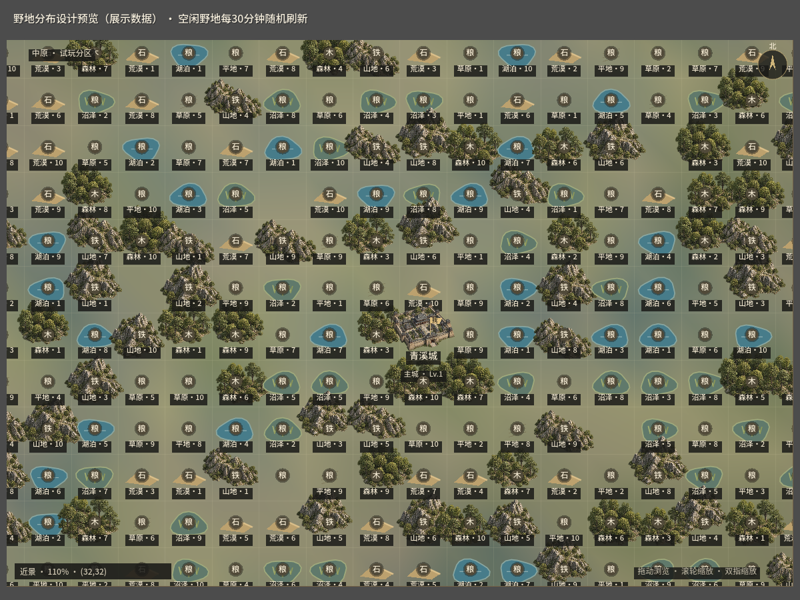

# dev.17：均匀野地与随机刷新

## 实施规则

- 单机PVE世界仍为64×64。每个8×8区域独立打散七种野地类型，每种候选格9或10个；独立打散1–10级，每级6或7个。固定主城、任务据点、名城和保护目标覆盖候选格，因此实际野地数量会有少量差异。等级不再随离主城距离提高；行军距离与原粮耗规则继续生效。
- 每30分钟刷新所有空闲野地的类型、等级和守军配比。每份存档有独立随机种子，同一轮和同一存档内结果稳定；重启不会重新抽取。刷新采用真实时间的半小时边界，首次进入可能不足30分钟就遇到下一轮；离线后直接进入当前轮次。
- 已占领、已建城、驻军、采集、出征、侦察和未结束战斗涉及的目标固定。释放保护后回到当前轮的随机结果，若实际目标变化则清除旧情报。已占领野地的原每日降级规则继续适用。
- 刷新会影响真实守军、掠夺资源和占领产量加成。继续使用原野地等级战力预算、兵种价值换算、负重与战斗结算；本次不改任务收益或商城价格。
- 空闲野地刷新时，旧侦察情报失效。出征和侦察预览携带目标版本，服务端在确认前检查；旧版本须重新预览。已提交请求仍按原回执机制防止重复执行。
- 地图显示刷新倒计时；近景显示野地类型与等级。湖泊和沼泽增加不同水面与湿地标记，荒漠用沙丘区别于山地。隐藏任务地块继续隐藏。

这批分布和刷新时间为用户要求下的试玩设定，不是对原版历史刷新机制的考据复刻。共享房间仍使用既有共享规则，本次范围为单机PVE。

## 实现与存档

`bridge/wild-fields.mjs`管理分布、轮次、保护记录和情报失效。`bridge/world-runtime.mjs`在内存中扩展自包含的原规则工厂，逐一匹配源码锚点；原工厂变更时会明确报错。`vendor/legacy`文件保持固定快照，没有修改。这样原规则函数内部的侦察、出征、战斗和收益均使用同一野地，而非仅更换地图DTO。

扩展记录位于存档顶层`wildRefresh`，切换城池不重置。旧档首次接入保留已保护目标的旧类型、等级及原配兵；其他野地采用新分布。桥接启动／轮次变化以原子写入保存扩展记录并增加版本号；导入仍先校验原规则及扩展结构。构建清单分别记录原工厂哈希和实际扩展工厂哈希。

## 本次检查范围

- JavaScript语法检查、Godot脚本导入编译完成。
- 静态地图设计场景使用独立内存展示数据生成下图；不连接游戏服务，不读取玩家存档，不执行出征、购买或战斗。
- Windows与Web包已导出，发布资产与本地构建清单核对SHA-256及大小。
- 未新增或运行功能测试，尚未实战验证跨轮刷新、旧档保护、多城目标和完整侦察／占领流程。历史检查记录不代表这些新规则已验证。

