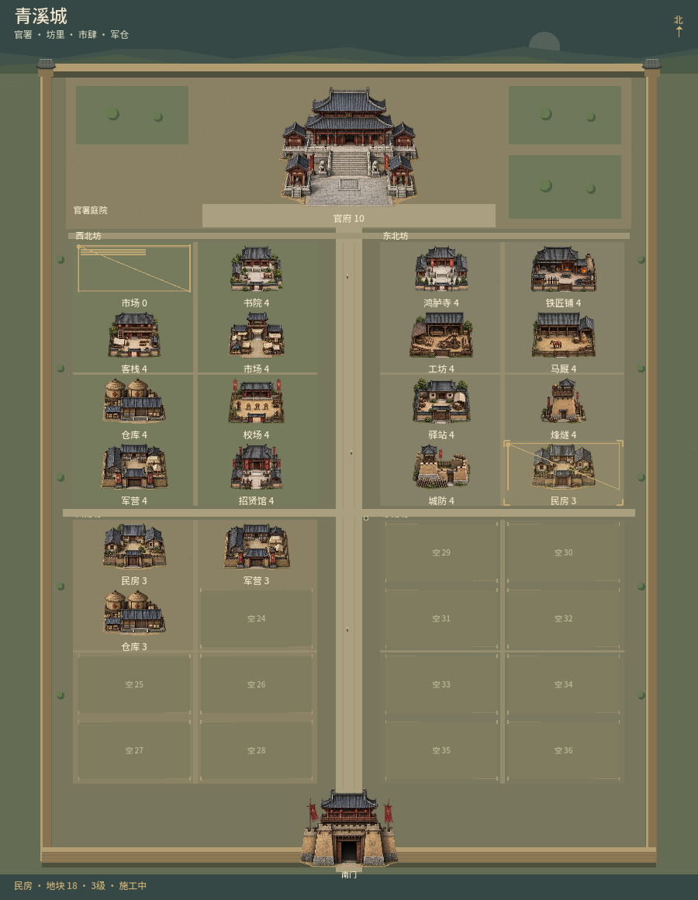
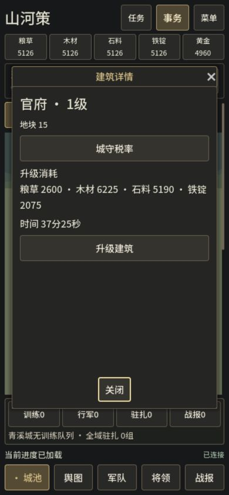

# 城内建筑贴图与体量

2026-10-07，山河策 Godot 0.6.0-dev.8。用户希望贴图与城内建筑更威武，本轮增加两套统一风格的透明建筑图集，实际覆盖当前规则的16种城内建筑与南门（图集另有1张备用募兵所，不显示为新建筑）。官署强调深檐、石台基、台阶与两侧院落，门楼保留夯土结构，军营、仓廪、市场及其他设施各有用途轮廓。瓦面、木构、土墙、军旗、炉窑、粮仓和庭院细节取代原本较薄的程序小图。

## 实现

`src/city_view.gd`按`data/city-art-atlas.json`中18个实际alpha边界区域生成AtlasTexture，同一源Texture2D只加载一次。透明边缘、原始宽高比和底部锚点保留，预留末行等级标签，施工脚手架与选中反馈覆盖在贴图上层。源图缺失时仍能使用原程序场景。未建空地、保留地、缺失DTO与0级地基不会显示完工贴图；重复建筑继续按实际site分别选择。

桌面城内画布最低1160高、平面宽度最多900；北庭196高、官署地块180高。窄屏画布900高、北庭148高、官署地块132高，通过父滚动区浏览。道路、四坊、南门前庭与地块布局随尺寸安排，不修改实际site或建设规则。城外仍沿用上一轮田庄场景。浏览器窄屏点选实筑时发现既有建筑费用标签未换行，导致详情窗口横向溢出；本轮同步让升级费用、条件及空地建设费用/时间换行，建筑等级按整数显示，权威报价与命令不变。

## 资产与生成方式

使用Codex内置`image_gen`工具生成，两张均1536×1024 RGBA、真实透明，原始输出保留，项目副本像素未修改。不是CLI生成，不使用Python编辑图片。Python/PIL只读核验alpha、区域和摘要；Godot以图集region裁取。风格为古代战争游戏表现，不声称精确复原某一年代或古城。

| 资产 | 用途 | SHA256 |
| --- | --- | --- |
| [核心建筑图集](../../assets/environment/city/city_buildings_commanding_v1.png) | 官署、门楼、军营、仓库、市场、民居 | `79aac8d80bf5ed2d5f295a0b938fd1e73764bbb079a4db6d30e151e14b833d0d` |
| [设施建筑图集](../../assets/environment/city/city_facilities_commanding_v1.png) | 书院、鸿胪寺、客栈、招贤馆、马厩、铁匠铺、工坊、烽燧、城防、校场、驿站、募兵所 | `068a3d669d571de96f3ad89946d7a796fda78614e1d6676a9e4631c934e1d458` |

最终完整提示词分别保存在[核心建筑生成记录](../../assets/environment/city/GENERATION.md)与[设施生成记录](../../assets/environment/city/FACILITIES_GENERATION.md)。两图边缘最大alpha分别4、7，18个区域在各自源图内不交叠。导入使用无损纹理，真实源尺寸保留。

## 最终验证

最终相关12个GDScript入口5380项通过（初轮5361，手机换行修复后复跑受影响客户端236及建设窗口82；新增19项实际390窗口/文字边界断言），macOS主整合88项通过，真实Viewport→ScrollContainer合成触摸headless24＋macOS24通过。两种图集的实际透明、摘要、区域、比例、标签、地块命中、缺贴图fallback、0级地基与升级施工均已核对。独立只读复核无阻断。

Windows/Web最终包300项核对通过：归档183、两包compiled PCK各51、Web HTTP15。两PCK实际由macOS Godot载入，连接随包解压规则服务，18个图集region加载正确、16真实设施及门楼实际绘制、无新增募兵所。Windows EXE只核对导出与PE，不声称Windows实机运行。

最终浏览器1280×1000与390×844实际观察，官府点选打开真实地块15，费用换行且等级为整数；空地36打开该地块建设选项，窄屏滚动到达南门且未误开建设。没有提交消费，revision0；原进度和副本save摘要保持相同。首个预览启动因复制了瞬态运行锁而拒绝连接，原锁/服务未动，仅副本锁移到旁边；最终导出切换时旧页面有一次Failed to fetch。2026-10-07T07:10:48.244Z最终重载后warning/error0。后台输入曾有浏览器focus接口超时，最终可见tab76点击成功，临时viewport已恢复。

最终检查与截图记录在`production/qa/evidence/story-014/`，聚合见[QA结果](../qa/evidence/story-014/qa-summary.json)、[包核对结果](../qa/evidence/story-014/package-audit-summary.json)与同目录build-manifest.json。展示城池采用prepared fixture，仅用于多建筑、施工、空地与标签验证，不能用来判断自然成长或资源平衡。

原网页仓库及Pages、既有经济与存档格式不变。Windows导出和macOS加载Windows PCK不能代替Windows EXE实机运行；窄屏浏览器/合成触控不能代替物理手机测试。

## 当前试玩与输出

[本机新版试玩](http://127.0.0.1:17356/) 由本轮服务继续运行，数据为`.local/commanding-art-0608-preview`，Web来自`build/commanding-art-0608-final/web`，旧17355和原进度保留。此localhost地址供当前电脑使用。

| 产物 | 字节数 | SHA256 |
| --- | ---: | --- |
| `ThreeKingdoms-Godot-v0.6.0-dev.8-Windows-x64.zip` | 91754301 | `3cbf407ad8db39ac14d35800d3ace91cbe76dab4a9aa98b2b57ee2981032777b` |
| `ThreeKingdoms-Godot-v0.6.0-dev.8-Web-preview.zip` | 63911827 | `e0035a63070f79cf427b16a37e39b6445869daf95ee7efcaef8b52c0254254e4` |

源图集、18区域元数据、完整提示词和导入配置均在独立Godot仓库保存；资产由内置image_gen生成，非CLI。原three-kingdoms仍clean且HEAD为`c7674df45b9595405e57907524e737e633b0ff63`；vendor无差异，Pages未部署。Graphify最终本地code-only/exclude刷新及no-label聚类为1320节点、3496边、78社区；GDScript与SQL提取限制保留，图谱未覆盖新贴图，实际依赖由源码与运行补齐。main HEAD c6b96d0，009–014工作区未提交，不推送或公开Release。

