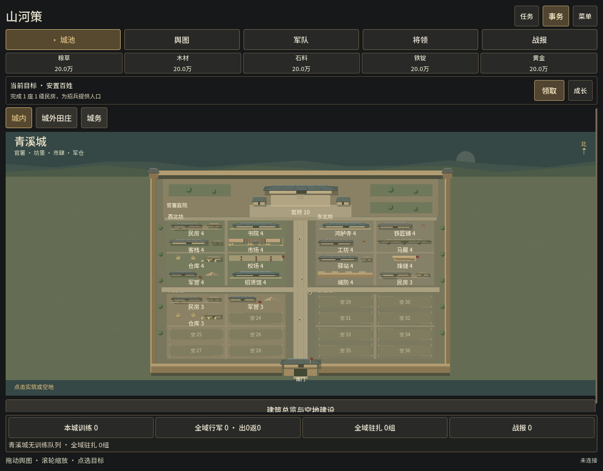
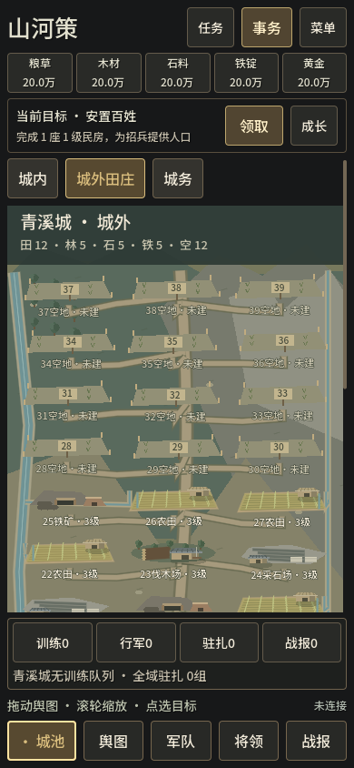

# 城池与田庄的历史空间结构 · 0.6.0-dev.7

2026-10-07。故事013 Complete，版本0.6.0-dev.7。用户要求历史感来自城池与生产地的空间组织。本轮只在独立 Godot 仓库调整场景、地块选择与建设详情，沿用权威建设规则和存档格式。最终scoped源码回归4943项通过（GDScript4912＋Node31），原生主整合69项、独立触控链路48项、最终包241项检查通过；1280与390实际导出Web已观察。本地交付，不提交/推送或公开Release。

## 空间改动

城内以夯土城垣围合，南门连接贯通主街，横街与支巷连接四坊；北侧官署采用主堂、侧屋、台阶和前庭，原保留地成为官署周边的庭园与通行地。住宅用多栋小屋围成生活小院，市场有围院、市门、摊棚与市楼提示，军营有营房、帐棚和操练空间，仓储有架高粮囷与库房；马厩、工坊、烽燧和城防也有不同轮廓。绘制强调院落、道路和建筑用途，取消已建地块的整块卡片底色，避免把城池呈现为建筑按钮阵列。

城内所有建筑均来自 `view.buildings`，不把 `buildOptions` 中未建选项绘成房屋。36个实际位置中的官署14和保留地15/20/21保持北侧官署关系，32处其余位置按真实 site 固定投影到四坊。已有建筑、重复建筑和空地不会因 DTO 排序、轮询、建成或场景重建而换位；保留地不提供建设操作。为遵守实际地块身份，四坊使用西北/东北/西南/东南的地理名称，不因用途重新搬移玩家建筑。已建记录为0级时显示基础与施工架，已有建筑升级时显示施工状态。

城外从资源按钮清单改为地景：城门道路通向实际地块，农田接水渠，木场表现林地与伐木场，石场表现裸露采石面，铁矿表现采掘口与冶作设施。空地保留真实编号和裸地状态；只有已开放地块进入命中与选择记录，未开放地块没有可执行入口。道路、水渠和树木只表达地景，不添加产量、运输或邻接加成。

主界面提供城内/城外田庄切换，城务入口和城外样板默认折叠。选中具体建筑、空地或生产地后打开该处详情；重复建筑升级与空地建设均传递精确 site/index。城池、身份、地块类型、施工队列、连接和 pending 状态变化时核验上下文，拒绝过时按钮与重复命令。城外空地的农田、木场、石场、铁矿分别显示桥接返回的首级费用、工期和前置/资源状态，不使用农田报价替代其它用途。

## 历史参考与表现范围

中国国家博物馆的[市楼画像砖说明](https://www.chnmuseum.cn/zp/zpml/kgfjp/202110/t20211028_251942.shtml)介绍了汉代围合市肆、市门、市楼与住宅里区分离的关系。本场景借用这种组织关系、院墙和门楼来表达市场用途。孙机[《古代城防二题》摘要](https://www.chnmuseum.cn/yj/xscg/xslw/201812/t20181224_36501.shtml)说明古城普遍使用夯土城墙、砖砌普及较晚，本轮据此采用土城垣而非满城石砌轮廓。

这是面向建设玩法的汉代风格艺术构图，不是某座县城的测绘或精确历史复原。官署位置、场景比例、院落简化和通行空间用于清楚表达游戏状态；美术为 Godot 程序绘制，不宣称已经完成正式写实素材，也没有新增历史制度、城防效果或经济公式。

## 触控与场景验证

手机场景高于可见窗口时，按下地块即激活会把滚动误当建设选择。最终场景改为松手后确认短距离、同一地块的单指点击；拖动、取消、多指和城池切换不激活。触控产生的模拟鼠标事件不执行地块选择，而是交给父级 ScrollContainer；真实桌面鼠标仍可直接点击。

Godot 4.7官方[InputEvent说明](https://docs.godotengine.org/en/4.7/classes/class_inputevent.html#class-inputevent-constant-device-id-emulation)定义了模拟设备编号，官方[ScreenTouch说明](https://docs.godotengine.org/en/4.7/classes/class_inputeventscreentouch.html)提供取消和手指索引语义。独立验证通过真实 Viewport → 场景 → VBox → ScrollContainer 事件链进行：24项 headless 与24项 macOS原生检查均通过。多帧拖动使父滚动区移动68px且不选择地块，松手点击只选择一次；大幅拖动和取消不选择。不是仅直接调用 `_gui_input` 的模拟断言。

根代理在最终源码冻结后完整重跑本轮相关11个GDScript入口，headless **4912项通过**，全部exit0、无SCRIPT ERROR/ERROR。分别为city2714、suburb893、主整合63、battle70、client236、management85、input255、realm22、playable125、polish351、war98。该计数是本轮涉及建设、场景、输入及兼容性的scoped范围，不等于重新执行上一版本所有32个GDScript入口。

最终主整合macOS原生 **69项通过**，1280与390的城内、城外和具体地块详情共6张prepared截图已更新。原生截图、几何与命中复核涵盖连续主街、官署庭院、建筑/空地身份、44px手机命中、窄屏滚动、重复建筑精确升级、全队列阻止建设、pending/断线和过时地块上下文；独立最终源码复查无阻断发现。最终数量来自[qa-summary.json](../qa/evidence/story-013/qa-summary.json)，原始成功日志和scoped条目明细保存在同一证据目录。

真实Node桥接与realm检查最终31项通过，0失败、0跳过。新增HTTP验证逐一核对空地四种用途的报价、实际支付与施工队列工期。初轮测试误将两支施工队当作可同时排入四项建设，改测试逐项推进模拟规则时钟后通过，没有改变生产规则或队列上限。中后期prepared进度与首战自然模拟来自既有realm测试重跑，不作为本轮新增长局测量。最终原始日志为 `.local/historic-0607-qa/canonical-final.log`，运行39027.939ms。

## 证据与数据区分

原生 prepared developed fixture 截图位于 `production/qa/evidence/story-013/historic-city-developed-fixture-1280.png`、`historic-city-developed-fixture-390.png`、`historic-suburb-developed-fixture-1280.png`、`historic-suburb-developed-fixture-390.png`。该 fixture 直接设置建筑与资源用于检查多种轮廓、重复位置、高阶生产地和详情入口；不来自玩家存档，不代表从新城自然成长所得，不用于宣称真实耗时或平衡。

实际最终导出Web已在1280×1000与390×844观察，独立预览为[本机试玩](http://127.0.0.1:17355/)，数据 `.local/historic-0607-preview` 是17351预览进度的副本。内城显示实际官署14与32处空地，点击site35打开“空地36”的费用和工期；城外显示12处实际已开放地块，选中index2打开“3号空地”，滚动可查看四种用途各自报价。390下铁矿按钮与样板可完整触达；城内下滚至南门没有误开地块弹窗。手机主整合城内高度660px、实际地块命中达到44px。最终页面连接正常、停在城内，临时viewport已重置，tab73与预览服务exec77975保留。

没有提交消费命令，最终revision0、mutations0，15项最终Web HTTP检查确认资源状态与持久存档未改。旧17351及其它试玩数据保留。物理手机未运行，浏览器390布局/鼠标滚轮观察与独立原生合成触摸分别记录，不能替代真实手机硬件测试。

浏览器历史日志在06:29:01.565Z记录过一次 `TypeError: Failed to fetch`：本轮本机规则服务为加载最终DTO停止/重启时，旧客户端仍在轮询。06:34:02.580Z最终重载后警告/错误为0；[web-observations.json](../qa/evidence/story-013/web-observations.json)保留历史瞬断，不声称整个tab从未出现错误。

## 最终构建与边界

最终Windows/Web产物位于 `build/historic-0607/`，**241项检查通过**：归档审计174、两份编译PCK各26（合计52）、最终本机Web HTTP15。两份导出PCK均由macOS Godot加载并连接各自解包的本地规则服务，exit0、无消费指令；Windows EXE没有执行。归档/PE/WASM资源与哈希检查、macOS加载同一PCK、实际最终Web浏览器观察分别提供证据。

| 最终包 | 字节数 | SHA256 |
| --- | ---: | --- |
| ThreeKingdoms-Godot-v0.6.0-dev.7-Windows-x64.zip | 87496657 | `9194c831121e8534f5ec49ca837d136ee32a8118d09b68bc0410aadbe5a9be0c` |
| ThreeKingdoms-Godot-v0.6.0-dev.7-Web-preview.zip | 59654183 | `82798e0abdf8de327794ca42500dc5fc41fd49650cc7b4b153e94377fc0ff967` |

最终[build-manifest.json](../qa/evidence/story-013/build-manifest.json)与[package-audit-summary.json](../qa/evidence/story-013/package-audit-summary.json)记录版本、字节数、摘要、编译PCK和HTTP范围。规则来源仍为原网页c7674df，runtimeHash保持 `432f9fea6359c18a8d1e2655b09f97770718c3e676501c602c7897afd906a8b4`。

Windows EXE没有在Windows实机运行。公网、真实Supabase、正式PvP军情隔离、Steamworks及既有故事007限制保留；本轮不读取账号凭据、不启动17345/17346、不部署原Pages或公开Release。原 `three-kingdoms` 仓库仍clean，vendor快照不改。独立Godot仓库为main，HEAD `c6b96d0`，009–013源码、文档与证据在工作区，未提交/推送。

Graphify最终刷新完成，使用既有本地 `extract . --code-only --exclude '.claude/**' --exclude 'docs/engine-reference/**'` 与 `cluster-only . --no-label`，1320节点、3496边、78社区；32个code文件重新提取、130个缓存复用、238个非代码文件与354个不支持文件跳过。GDScript、SQL及IIFE覆盖限制保留，不从图谱缺失推断没有依赖；不启用watcher、hook、外部语义后端或上传。
