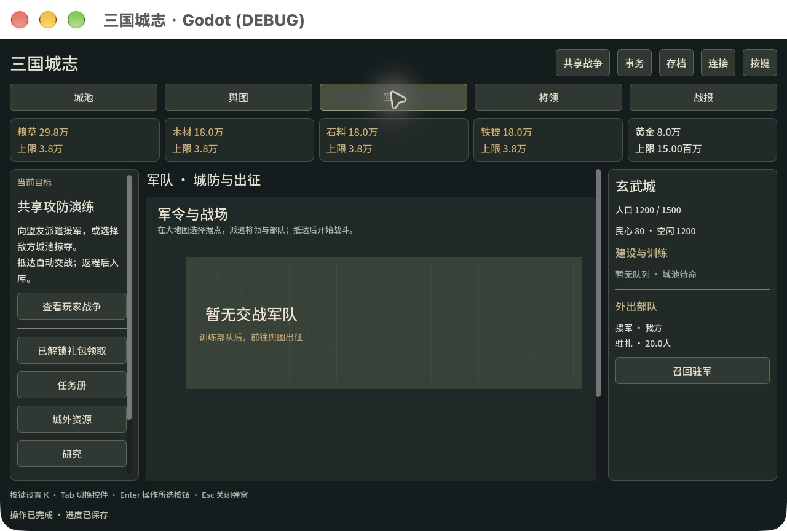
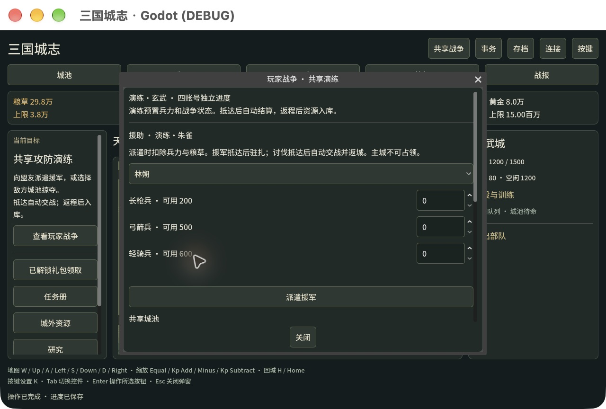

# 0.4.0 四账号共享攻防验证

2026-10-06。CCGS minimal dev-story → story-done，故事005。本地共享攻防闭环已完成，用户暂缓的地形、补给与重玩策略方案未实施。Godot 4.7.2 / GDScript，macOS 原生与实际 Web 观察，最终 Windows/Web 本地导出；0.4.0 未推送或发布。

## 交付行为

四个虚构演练账号独立鉴权、进度与权威身份，公共地图显示玩家城池、关系和本方行军。两组联盟与战争状态、初始资源和兵力由演练场景预置。可攻击敌方玩家、支援盟友、召回驻军；服务器自动处理抵达、战斗与返程，下线不会暂停或要求手动确认。战报区分生还、永久损失、伤兵、缴获与实际已交付资源。

共享服务复用原作 c7674df 的规则快照；`vendor/shared/provenance.json` 记录来源和各文件摘要。客户端不能上传时间、身份、战损或资源结果。整个共享世界、玩家状态与回执在候选事务中原子写入；持久化失败撤销候选状态。私人存档入口在共享模式禁用，NPC 野地出征保留在私人试玩。

## 最后审查与修复

- 按原 commandId 分别保存本地/Web 待确认操作；同账号多个窗口的不同操作不会覆盖，确认只删除自己的记录。可读取旧版单文件记录；旧客户端升级前需关闭。
- 缓存 ACK 确认原操作后刷新，但不把旧状态或世界重新展示；即使 ACK revision 高于私有状态，时间早于已接受世界快照也会拒绝显示。
- 切换账号、权威身份或模式时，清空库存、目标、签名与页面数据，释放旧弹窗；新状态读取失败时不会显示前一账号内容。已失败的健康鉴权不被当作成功身份切换。
- 获取进程锁时以独立原子 guard 串行检查、移除旧锁和创建新锁，避免两个恢复者同时成为写者。guard 本身中断后保留并拒绝启动，需明确停掉所有进程后人工恢复。
- 全局行军、交易、联盟与标记实体 ID 在支出前检查碰撞；不同账号不能因相同出征 ID 扣兵后丢失行军。已确认原编号重试继续由原作回执处理。

后端作者之外的代理复核锁恢复与实体碰撞，客户端作者之外的代理复核回执、水位和身份清理，最终均 APPROVE。solo/minimal 不要求正式 director gate；这些独立复核是本轮附加检查，没有声称全部上游角色或自动 hooks 在运行。

## 自动检查

根代理在最终源码重新运行下表；真实浏览器探针单独导出并实际加载，未用 headless 结果代替 Web Storage。

| 范围 | 通过检查 | 证据日志 |
|---|---:|---|
| 原桥接＋共享 HTTP | 45 | `.local/pvp-http-resumed-final.log` |
| 地图行为 | 24 | `.local/pvp-world_map-resumed-final.log` |
| 城池/战斗绘制 | 31 | `.local/pvp-battle_view-resumed-final.log` |
| 主客户端及身份清理 | 236 | `.local/pvp-client-resumed-final.log` |
| 城池事务 | 79 | `.local/pvp-management-resumed-final.log` |
| 电脑输入 | 255 | `.local/pvp-input-resumed-final.log` |
| 地图绘制与几何 | 215 | `.local/pvp-map_render-resumed-final.log` |
| 共享 API 与恢复 | 89 | `.local/pvp-pvp_api-resumed-final.log` |
| 共享配兵 UI | 49 | `.local/pvp-pvp_ui-resumed-final.log` |
| 实际浏览器回执存储 | 17 | `WEB_PVP_STORAGE_CHECKS: 17 passed, 0 failed` |
| **合计** | **1040** | **全部通过** |

HTTP 使用真实服务器与隔离数据，覆盖权限与私密字段、并发版本、原编号完整回执、双方及盟友战损、实际资源交付、重启与断线、写盘失败、实体 ID 碰撞、确定性旧锁争抢和获取中断。客户端用实际 SceneTree 与受控 transport，覆盖桌面/390 宽的身份切换读取失败、多窗口日志写删交错、恢复、延迟回执和世界时间水位。该数量是检查/断言计数，并非1040场人工对局。

## 实际原生/Web 观察

本轮暂停前，独立演练目录完成真实时间的三账号流程：macOS 账号4向账号3援助100长枪兵，自动驻扎；Web账号1出征至账号3，第一次少量兵力失败，断线后的原编号确认只结算一次。第二次1199骑兵＋792弓兵，24秒抵达自动获胜，24秒返程后粮草29957、木石铁各18000、黄金8005实际入库。攻方生还骑787/弓792、骑兵永久损失268/伤兵144；守方合计永久损失枪340/弓425/骑340，伤兵60/75/60。守方与攻方参与者战报核心字段一致，盟友损失归原玩家。随后账号4再派50长枪兵，驻扎、召回与返城后可用200兵力均在实际窗口观察。没有手动 battle confirm 或客户端 settle。

最后修复后重新启动相同服务、加载最终 Web 导出，成功读取原持久世界和一致的交付战报。最新原生账号4再派20长枪兵，成功回执自动清掉配兵表单，地图显示路线与倒计时，抵达后驻扎，再召回并自动返城。最终实际 Web 回执探针17项通过；浏览器 warn/error 为空。窄屏观察曾覆盖390×844的事务入口与共享配兵，不能等同真实手机触控或目标平台性能。

## 最终包

最终源码完成 Godot 导入、Windows 与 Web release 导出；日志 `.local/build040-resumed-final.log` 与 `build/*-export.log`。独立代理核对 ZIP、清单、规则模块、启动器、来源摘要和私有数据排除；包内14个必需模块逐字节与最终源码匹配。

| 产物 | 字节 | SHA256 |
|---|---:|---|
| ThreeKingdoms-Godot-v0.4.0-Windows-x64.zip | 86933658 | `00325608be31d3ec10b92a0199da3bbae776697de88597ca40e813cb396a78ad` |
| ThreeKingdoms-Godot-v0.4.0-Web-preview.zip | 59092792 | `f5d8785bf4b8525311f8e11202149776d4b167d095c0630c8fa410fcaefea671` |

独立包内烟测从最终 Web ZIP 解压载入 Node 模块，使用 macOS Node host、仅服务器注入时钟、25ms scheduler 与可丢弃数据。验证四身份、完整合法存档、401/私有凭据404、自动援军、自动城战、双方相同战报、盟友伤兵、返程交付等于缴获，以及晚到原 ACK 不会重复交付；退出后服务与私有测试数据清理。证据 `.local/pvp-package-smoke-result-final.json`。此烟测不是 Windows exe 运行，也不是前述实际24秒计时观察。

Windows完整解压后运行 `StartPvP.cmd`，再运行 `PlayPvP1.cmd`～`PlayPvP4.cmd`。Web包运行 `StartPvP.cmd` / `start-pvp.sh`，从私有本地邀请页选账号。详见 [操作说明](../../docs/PVP-REHEARSAL.zh.md)。用户原17339私人预览与 `.local/play` 不作测试数据使用。

## 范围与后续

0.4.0 Windows实机/CI尚未执行；0.3.1公开发布及其Windows成功记录仅为历史版本。没有0.4.0 GitHub Release、公网/Supabase部署、Steamworks、跨电脑真实登录、百人压力或长局平衡结论。当前只接受loopback，四个虚构账号不能替代正式账号系统。

原网页仓库保持clean、HEAD c7674df，`vendor/legacy`、原单人桥接和原Pages未改动。Graphify同原code-only排除flags与本地cluster-only完成刷新：682节点、2067边、42社区；不覆盖`.gd`与部分IIFE/嵌套逻辑，没有watcher/hook/外部语义后端或上传。

故事005可完成；大幅策略重做继续暂缓。下一阶段可用本机账号进行攻守、支援与断线试玩，收集当前规则问题，再配置真实账号及托管权威服务。没有自动安排或开始这些后续部署。
