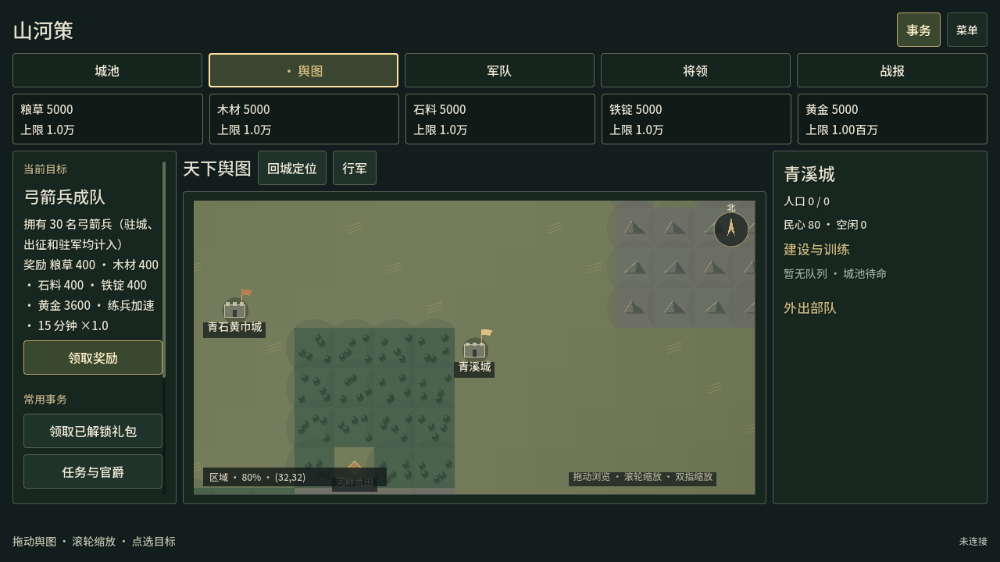
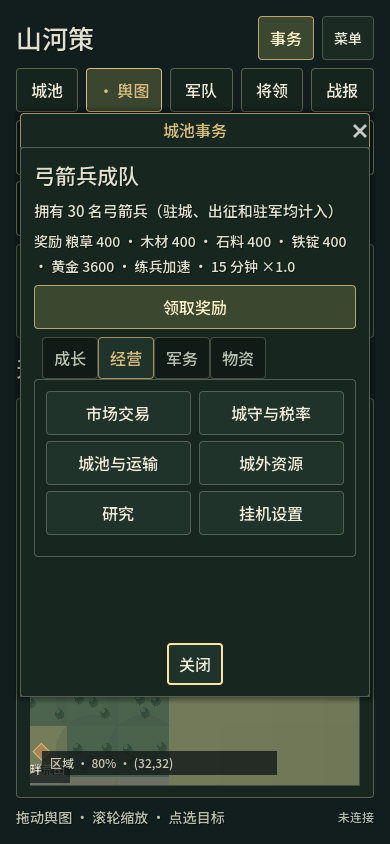
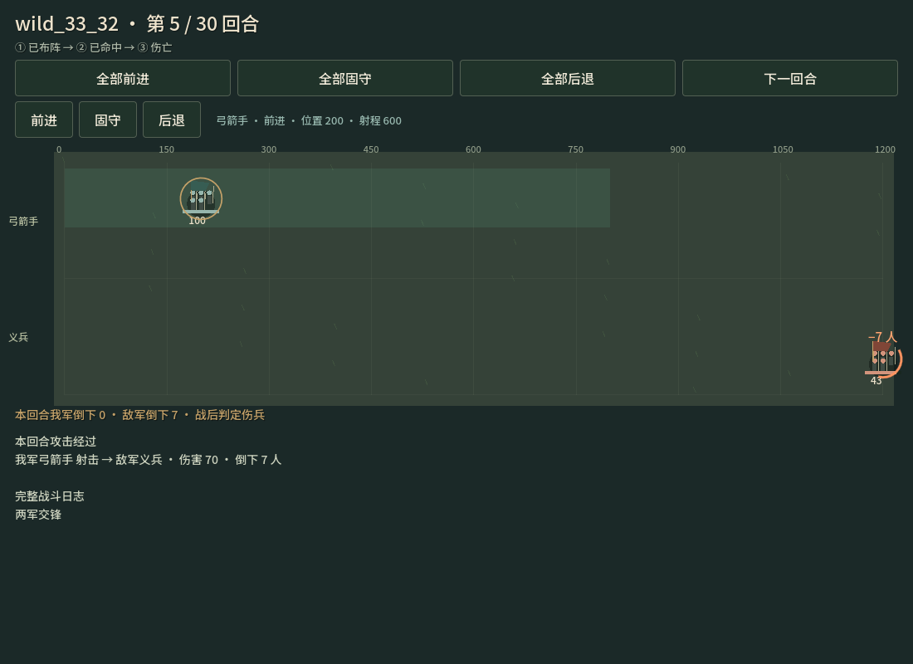
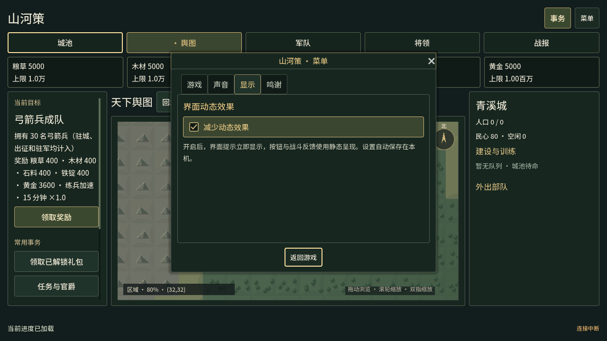

# 界面与操作反馈验收

2026-10-06，独立Godot客户端 **0.6.0-dev.3**。故事009完成。本轮使用 game-ui-ux、game-ui-design 和 game-feel，沿用 Godot 4.7.2、GDScript、容器布局及 canonical 规则桥接。

## 玩家可见变化

顶栏保留“事务”和“菜单”，五个游戏页有文字与选中态。事务从平铺入口改为成长、经营、军务、物资四类；原有功能仍能进入，存档、连接、按键与声音从菜单可到达。资源卡改为紧凑布局，超仓同时用文字、颜色和精确数值提示。

桌面保留侧栏完整目标与奖励；宽度小于1000时，资源下方显示当前目标和行动按钮，390宽度也能看到。目标完成、身份切换、断线及未确认操作同步更新两个入口；当前事务窗口仅更新目标，不重建分类或滚动位置。

统一面板、主要按钮、悬停、禁用与键盘焦点视觉。主要按钮至少44px；确认回执和短暂反馈不阻塞下一次输入。关闭弹窗恢复原焦点，弹窗切换时不跳回后台操作。

战斗用最多0.95秒呈现移动、攻击、伤亡，跳过不存在的阶段。只解释规则记录的事件，末尾恢复实际位置与人数；相同回合轮询不重播。每回合列出攻击双方、伤害和倒下人数，并显示双方损失及战斗结果。

菜单新增“显示”页和持久化“减少动态效果”。开启立即呈现结果，不重播已结束回合；按钮与提示使用静态反馈。保存失败恢复旧配置，损坏配置回到默认。动画与菜单不会改变建设、行军或战斗规则时间。

## 修复与自动检查

目标领取指令发出后立即禁用目标按钮，避免回执返回前再次发送。回执、明确失败和连接状态变化同步恢复可用状态。

完整回归还发现旧事务弹窗移出场景树后，排队的关闭按钮仍调用 grab_focus。修复为弱引用，并检查弹窗有效、在树、可见且仍是当前弹窗，才设置焦点。lobby_ui_test 修复前出现4条引擎错误；最终从头完整重跑，无 ERROR / SCRIPT ERROR。

**本次自动检查共2264项通过：Node131、SceneTree2114、HTML脚本fixture19。** 22个GDScript入口的2133包含该19项HTML检查，没有重复加算。

| GDScript入口 | 实际检查 |
|---|---:|
| world_map_test | 24 |
| battle_view_test | 70 |
| client_test | 236 |
| management_test | 79 |
| input_test | 255 |
| map_render_test | 215 |
| pvp_api_test | 91 |
| pvp_ui_test | 52 |
| lobby_api_test | 60 |
| lobby_ui_test | 80 |
| presentation_test | 40 |
| ui_feedback_test | 60 |
| ui_polish_test | 351 |
| cloud_lobby_api_test | 64 |
| cloud_lobby_ui_test | 59 |
| cloud_lobby_html_test | 19 |
| hero_management_test | 56 |
| progression_management_test | 25 |
| war_management_test | 108 |
| inventory_management_test | 45 |
| realm_management_test | 21 |
| playable_ui_test | 123 |
| 合计 | 2133 |

新增 ui_feedback 覆盖动画退出、重复绑定、设置持久化、配置损坏及保存失败；ui_polish 覆盖390/768/1000/1280宽度、五页、四分类、目标领取等待、连接与身份切换、弹窗交接和焦点恢复。既有规则、私人/共享/房间与管理测试同时通过。原有 pvp_web_storage_test 为Web专用，本轮仅解析通过，未计作运行成功。

最终源码的实际原生 ui_polish 捕获另一次351项通过；战斗原生捕获70项、显示设置原生捕获60项通过。重复捕获没有加进2264的总数。日志在 `.local/ui-polish-qa/`，完整逐项数据为 `final-gd/summary.json`；旧错误日志单独保留。

## 实际画面与网页操作

最终导出网页在 `http://127.0.0.1:17348/` 运行，使用独立 `.local/ui-polish-0603-preview` 进度。实际观察1280桌面和390×844布局，事务成长/物资分类、目标卡、显示页及设置保存；刷新网页后“减少动态效果”仍保持选中，随后恢复默认动态效果。五页键盘导航与真实初始状态可用，浏览器无 error/warn。

重新导出后再次刷新最终页面。原生捕获使用隔离的固定快照，用于布局与阶段验证；这些截图中的弓兵、回合及奖励不是用户真实进度。原玩家17347/17339及共享17342、房间17343目录和服务均保留，本轮没有派遣、消费或重设玩家进度。

完整截图位于 `production/qa/evidence/story-009/`，包含五张界面捕获及六张战斗阶段/窄屏捕获。

## 最终包

Windows与Web均已重新导出；152项ZIP/CRC、哈希、完整规则源码、官方Node、启动入口、许可证和私人文件排除检查通过。两份最终编译PCK分别12项检查通过，均包含新UI模块及最终焦点同步方法；在macOS Godot加载实际PCK并连接17348，均返回 `GODOT_SMOKE_OK canonical_revision=0 tiles=4096`。合计176项包检查及两次启动烟测，不把PCK加载称为Windows EXE运行。

| 本地包 | 字节数 | SHA256 |
|---|---:|---|
| ThreeKingdoms-Godot-v0.6.0-dev.3-Windows-x64.zip | 87370790 | `2ef0f8634ceeb4e26f5f7f455cdac5fdb9d40577bc88ed3374bf37e21baa2ec8` |
| ThreeKingdoms-Godot-v0.6.0-dev.3-Web-preview.zip | 59528316 | `5d288a8599e9c9ea6f9e31c94342ad8b2d5cb6a8575cf6745fb9bea8b3ded2e4` |

构建目录 `build/ui-polish-0603/`，详细清单为该目录的 `build-manifest.json` 与 `SHA256SUMS.txt`。未创建公开Release。本轮未执行Windows EXE、真实手机硬件、手柄、公网/真实Supabase/Steam或自然长局平衡验证。

## 保持与下一步

原three-kingdoms仓库仍clean；冻结vendor规则、经济、技能、存档格式不变。Graphify按原 `extract . --code-only --exclude '.claude/**' --exclude 'docs/engine-reference/**'` 本地刷新并 `cluster-only . --no-label`，仍1169节点、3097边、62社区；.gd和SQL覆盖限制保留，不启用watcher、hook、语义后端或上传。

下一步由真实试玩收集菜单查找耗时、误操作、窄屏目标可读性及战斗原因是否看懂；本轮完成表现改进，不宣称解决长期成长或商业版全部内容。
