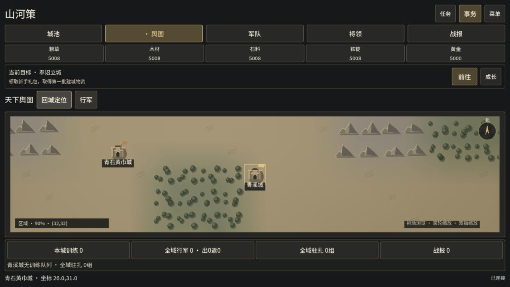
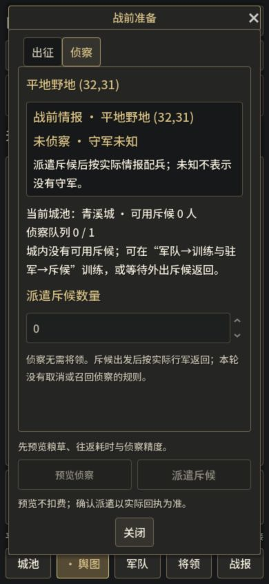

# 战争界面 · 0.6.0-dev.6

2026-10-07。用户明确确认五项一起实施。使用已安装game-ui-design、game-ui-ux、pc-games与CCGS minimal；既有Godot和规则服务沿用。只改独立Godot版，原网页与vendor快照保持，云联调与Steam未推进。

## 改动

地图主体：桌面任务栏可展开，默认收起但保留当前目标；仅选中目标显示详情，关闭不重置镜头或改动目标原始数据。中等宽度760–999与手机使用同一战前准备窗口，避免缺失目标操作入口。

紧凑资源：五种资源一行，以万/亿简写，点击显示精确数量、容量和每分钟净产量，超仓明确。无当前身份数据时保持未知而不伪造0；已读快照断线时标注最后收到的数据。手机底部导航、44px触控按钮和键盘焦点保留。

同窗战前准备：侦察/出征切页，情报、将领、兵力、掠夺/占领返回、原报价和确认串起来。报价/确认在滚动区外，桌面右侧窗口、390自适应窗口。原规则决定粮耗、时间、运载；精确提交返回的命令、参数和出发城，修改条件/输入或pending/断线后撤销旧报价。不存在的胜率、共享玩家侦察或途中取消侦察不添加。

军队常驻：本城训练、全域可见行军/驻扎和实际战报数量，显示最近真实时间，0后待服务器结算。全部行军详情复用标签更新阶段与倒计时，正常行军/斥候按serverTime修正，返程使用returnAt，阶段变化按出发城/节点识别原记录，新增行军补齐，驻扎筛选随返程更新。行动按钮读取最新快照；旧私人规则召回先选择部队，再核对回执的出发城/节点/阶段，防止跨城同节点误召回。切身份立即清旧内容，导航不消费；没有虚构未读数。

战争氛围：深灰、铜金、米白统一主题，连续地形共享顶点颜色、森林/山脊与城墙门楼，保留原敌我/黄巾旗帜和隐藏据点。地形使用一个保留的ArrayMesh，避免临时RID提前释放；坐标、平移缩放、路线、筛选与稀疏索引保持。程序绘制美术，不宣称完成正式写实素材。

## 验收与证据

最终本地自动检查 **3166项通过**：Node183（0失败/0跳过）、SceneTree2964、实际HTML脚本fixture19；32个GDScript入口全部无SCRIPT ERROR/ERROR。最终主界面原生101项通过，覆盖1280/800/390资源文字、地图占比、报价提交、身份清除、焦点、行军阶段和固定操作栏。组件与主整合截图保存在 `production/qa/evidence/story-012/`，prepared库存/军队与自然新档分别标明；不替代正常玩家时长/留存或真手机验证。

最终完整顺序中31个入口通过，最后旧 `playable_ui_test` 在通用弹窗查新版出征按钮导致空引用中断；仅更新测试至 `_scouting` 统一窗口、新按钮和实际报价结构并增加失败退出后，125检查完整通过（exit0、14.570秒）。最终统计来自这32项最后成功日志，不将修前错误计为成功。所有本轮源码解析/导出检查通过，`git diff --check` 通过。

实际导出的Web17351已观察1280×720及390×844：任务展开/折叠、资源精确数/容量/净产量、地图拖动从(32,32)到(30,31)、缩放80%到90%、回城定位、选中目标才展开详情、侦察/出征同窗切换及固定确认区、手机点地图直接进入准备、底部导航。console warning/error为空；本轮没有发消费或派兵命令，最终新档revision0，临时viewport已重置。

最终两包 **480项检查通过**：归档172、两份编译PCK各71、解包Windows/Web规则服务分别82/84。校验CRC、清单/哈希、模块与私密文件排除；在macOS Godot加载两个最终PCK，读取隔离真实状态revision0与4096格地图。解包服务以prepared训练/兵力条件运行实际HTTP训练→侦察扣费→重放→抵达→返程→TTL，以及实际出征报价/精确参数/出发城/扣粮扣兵/活动列表/重放。Windows包内官方Node24.21做格式与资源校验，解包JavaScript实际由macOS Node24.19执行；Windows EXE未实机运行。

包审计初轮“整个view不含enemySnapshot”断言失败：既有私人API仍在 `view.cityList[].expeditions[].enemySnapshot` 和 `view.realmManagement.cities[].expeditions[].enemySnapshot` 提供原始城市远征快照。为保持本次界面范围与私人存档兼容，最终审计只对新界面实际使用的 `view.nodes/view.scouting/view.marches` 检查军情显示隔离，保留初轮失败及范围调整记录。**本报告不声称整个私人API或正式PvP军情隔离已经完成**。

统计与最终包审计分别见 [qa-summary.json](../qa/evidence/story-012/qa-summary.json) 和 [package-audit-summary.json](../qa/evidence/story-012/package-audit-summary.json)。

测试初轮发现并修复：760–999目标操作空窗、身份清除后的资源假0、行军列表旧时间/阶段、关闭目标对源Dictionary的误清除，以及同帧更换通用弹窗后旧数据仍挂在场景树。修前调试日志保留于.local/war-ui-0606-qa/，最后完整验收结果另列。

性能：并行Node/Postgres与原生测试时机器出现较高内存/交换压力，地图新旧渲染对比无效，未声称FPS改善。降低并发后验证功能与实际交互；绘制性能数字仅在同条件证据充分时报告。

## 构建与交付边界

本地0.6.0-dev.6两包位于build/war-ui-0606/，独立新档入口http://127.0.0.1:17351/，数据.local/war-ui-0606-preview。旧预览和玩家存档保留。不推送、不公开Release、不部署原Pages。Windows导出、macOS加载编译PCK与真正Windows EXE实机运行分开记录；公网/Supabase/Steam和真手机仍需后续实际验收。

Graphify已按既有本地code-only/exclude范围刷新并无标签聚类，1316节点、3486边、77社区；GDScript/SQL/IIFE覆盖不足，不将无节点当作无依赖。无监视器、hooks、外部语义或上传。

| 最终包 | 字节数 | SHA256 |
| --- | ---: | --- |
| ThreeKingdoms-Godot-v0.6.0-dev.6-Windows-x64.zip | 87457121 | `43b0d8e77c466557488f7e0a924386e0b0ebd282d3f2336fdd8a67e0bd5ce5c7` |
| ThreeKingdoms-Godot-v0.6.0-dev.6-Web-preview.zip | 59614646 | `70600202767795add2aceb756c046907d094f895151c887335535eb40c1c32b9` |

