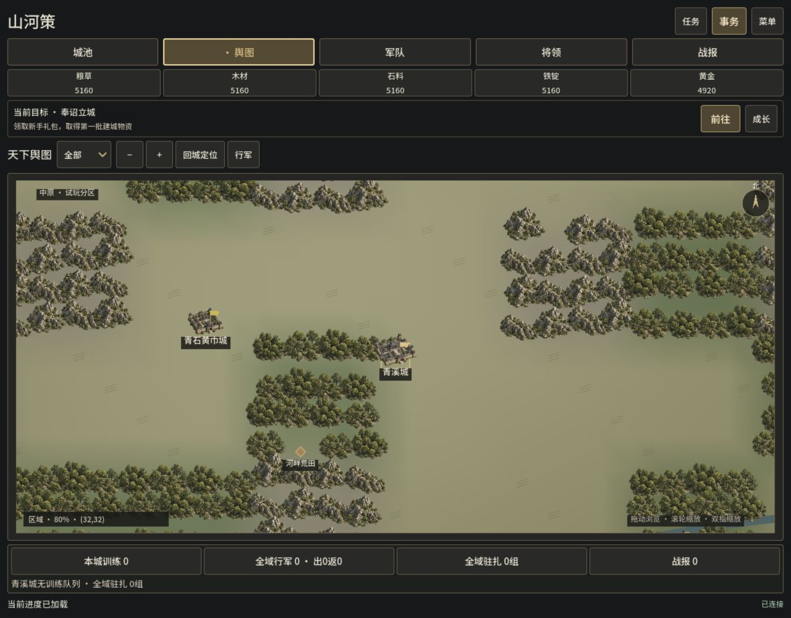
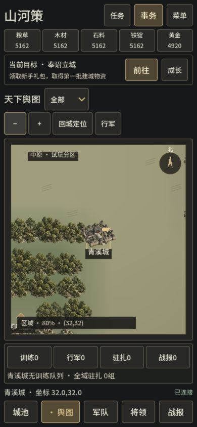

# 大地图山川、城池层级与操作

2026-10-07，0.6.0-dev.9；story-015 Complete。用户要求改大地图，沿用写实古代战争方向。独立Godot仓库实施，原three-kingdoms仍clean/c7674df，未部署原Pages、推送或发布Release。

## 实际变化

- 山地、树林和城池接入六区域透明图集；两类山体、两类林地、县城和较大的城池共享光向材质。坐标稳定的变体、尺寸和错位减少整齐重复，地形先绘、城市后绘，军队在上层。维持共享地形mesh、可视区裁剪、稀疏远景、2048坐标缓存和按需行军重绘。
- visible city DTO从冻结规则Game.namedCityProgress读取tier/tierName。县、郡、州、都城按真实层级选择大小/轮廓；玩家城池缺省ordinary，不用官府等级冒充行政级别。ownership/ally/enemy旗色优先，识别actual yellow_turban；近景黄/军/我/盟/敌旗字明确，未知英文势力不伪造汉字称号。
- 远景省略树林/山地模型和多数城名，区域显示主要目标，近景显示等级。名称和等级避免相互遮挡。地图工具栏提供全部/城池/资源/行军/任务、±1.2缩放、回城定位与原行军入口，根据可用宽度自然换行，筛选跨刷新/页面保留。山地资源修正为铁，丘陵为石。
- 城楼超出格子部分按缓存原图alpha命中，返回当前同id可见/可选的真实DTO；透明角穿透，过滤或DTO替换后的旧hit不选旧城。地块坐标及所有权限/报价仍由权威规则决定。
- 行军箭头沿from→to，驻扎/采集使用静止标记，路线增加暗底以与地形区别；真实返程青、援军蓝、来袭pvp红。serverTime加单调时间计时，ETA/插值不再依赖设备日历；缺少有效serverTime的隔离fixture保留系统时间回退。

世界仍为64×64。map_regions的北原/白石/河洛/中原/寒川是试玩分区，不是完整真实州郡。河流与道路仅表现，不添加通行、补给或战略规则；隐藏任务在贴图、名称、旗面、选中和点击层继续屏蔽。原城内/田庄功能保留。

## 资产

内置image_gen生成，源PNG像素/alpha不修改；项目素材`assets/environment/world-map/world_map_relief_v1.png`，1536×1024 RGBA、2694355字节，SHA256 `17aab33d8a0af320086a0bf6fbe6f26947d90dcc205de0d04cb8a9125ea2db39`。完整提示词及来源见[GENERATION.md](../../assets/environment/world-map/GENERATION.md)，六个人工核对区域在data/world-map-art-atlas.json，单张Texture2D和六个AtlasTexture只初始化一次，filter_clip=true、mipmaps=false。缺失资源可使用原过程绘制。没有CLI/API fallback。

## 验证与边界

相关七个headless入口1192 checks：world_map24、map_render215、war_visual50、input255、client236、war_interface98、world_map_art314。地图原生317（同样314合同＋3实际图），连续地形原生58（50＋8像素），工具栏真实控件探针59。Node层级最终5项通过，代理复用原bridge23项独立通过；不把初轮合并28进程称为28/28通过。初轮新Node夹具错误、GDScript变量名冲突和JSON dimension float/int比较在验证阶段修正，权威规则未改；原始失败日志在.local/map-art-0609-qa。

最终包186项归档/CRC/源字节/隔离/PE/WASM核对、Windows与Web编译PCK各59项macOS加载/解包规则服务（含真实atlas、服务器时间、tier和筛选）、HTTP18项，共322检查通过。Windows EXE未在Windows运行，390窄屏是浏览器模拟尺寸，未测物理手机；Steam与真实云服务本轮不启动。

实际最终导出Web已观察1280×1000与390×844。城楼顶部选中青溪城32,32、近景县/主城标识、铁资源筛选、拖动32,32→35,33、滚轮、分区远景及回城定位核对。warning/error日志为空；未发送建设/领取/派兵等mutation，revision0。17357使用17356 save.json精确副本，原与副本最终SHA256均 `bf0d7befeaae395b50c74caaf85764a6b2f1e1469fc547f1bde8155cd7e83725`。计时投影可能增长资源，但存档未写。

候选原生渲染诊断对比文件保留：两次脚本 workload/environment一致且各自source未变化，但before有并行负载，最终版本又小幅调整地形错位；不据此声称最终FPS、输入延迟或预算达标。256×256/200军队为合成绘图负载，不表示扩州或多人服务已完成。

原生地图图像使用隔离prepared-city canonical helper，不能代表自然成长；以下实际Web截图使用玩家进度副本。详见[QA摘要](../qa/evidence/story-015/qa-summary.json)、[浏览器记录](../qa/evidence/story-015/browser-observation.json)与[存档核对](../qa/evidence/story-015/save-integrity.json)。Graphify同本地code-only/exclude范围刷新，1327节点/3508边/77社区；.gd/SQL/IIFE覆盖限制保留，无watcher/hooks/外部后端/上传。

## 交付

本机预览 http://127.0.0.1:17357/，服务exec78920、交付tab77保留，临时viewport已恢复；旧17356及原进度保留。最终包build/map-art-0609，完整说明与校验随包保存。

| 包 | 字节数 | SHA256 |
|---|---:|---|
| ThreeKingdoms-Godot-v0.6.0-dev.9-Windows-x64.zip | 93690934 | `456685fa291fdf3f65fd1b6e81e87196719e4d3f4ee71fe60238afb94754bcff` |
| ThreeKingdoms-Godot-v0.6.0-dev.9-Web-preview.zip | 65848368 | `bc37f3d69cc5bf8d798e960c56c207d9a7a326af44ce4f5ebb7c5c42a3f13526` |

